# SPEC — Zeny Hotel Manager

> Especificação de requisitos · versão 0.1 (rascunho para revisão) · 2026-10-09
>
> Documento irmão: [ARCHITECTURE.md](ARCHITECTURE.md) (como o servidor é construído).

---

## 1. Contexto e visão

Sistema de gestão hoteleira (PMS + operações) para **um único hotel**, não uma rede. O hotel é de pequeno porte (até 30 UHs) e ainda está em implantação, então não há dados legados para migrar.

O sistema cobre:

- hospedagem;
- governança e manutenção;
- restaurante/bar aberto ao público;
- eventos e locação de espaços;
- rouparia com lavanderia terceirizada;
- estoque e compras;
- as obrigações legais brasileiras: FNRH Digital, NFS-e/NFC-e com IBS/CBS, LGPD e ECA.

A arquitetura é cliente-servidor. **Este repositório contém apenas o servidor**, que roda em container Docker e expõe uma API versionada (contrato OpenAPI). Os clientes desktop e mobile ficam em repositórios próprios.

As referências de mercado usadas para levantar funcionalidades foram:

- internacionais: Oracle OPERA Cloud, Mews, Cloudbeds, protel, apaleo e RoomRaccoon;
- nacionais: Desbravador, CMNet/TOTVS, Erbon e HSystem.

### 1.1 Registro da entrevista (decisões de escopo)

| Tema | Decisão |
|---|---|
| Porte | Até 30 UHs |
| Situação | Hotel ainda não opera; sem migração de dados |
| Serviços além da hospedagem | Restaurante/bar **aberto ao público** com PDV no sistema; lavanderia **terceirizada**, serviço de lavanderia ao hóspede e ciclo de vida do enxoval; **eventos completos** e **locação simples de espaços**. Não há frigobar. |
| Canais de reserva | Direto (balcão, telefone, WhatsApp), OTAs e site próprio. Não há tarifas acordadas com empresas ou agências. |
| Distribuição | Integração com **channel manager** de mercado; o motor de reservas do site vem dele |
| Tarifas | Planos tarifários com derivação, restrições e pacotes |
| Pagamentos | **Pix integrado**, **cartão integrado** (TEF/Smart POS com pré-autorização) e registro manual |
| Fiscal | NFS-e e NFC-e emitidas por **middleware fiscal** |
| Acesso | Roles **criadas pelo administrador** a partir de um catálogo fixo de permissões, com **escopo** (próprio/todos) e **aprovação de superior** para ações sensíveis |
| Dispositivos | Funcionários usam o **celular pessoal**, com login individual |
| Offline | O app operacional (governança, manutenção, checklists) funciona **offline**. Recepção e PDV exigem conexão. |
| Servidor | Local de hospedagem **indefinido** (nuvem ou servidor no hotel); a arquitetura suporta ambos |
| Governança | Distribuição **sugerida automaticamente** por créditos e ajustada pela governanta. Inspeção **configurável por tipo de limpeza**. Checklist com baixa de estoque, troca de enxoval e ocorrências; foto não é exigida. |
| Checklists | **Motor genérico**, usado por governança, manutenção, áreas comuns, restaurante e eventos |
| Estoque | Nível **intermediário**: saldo por local, NF-e XML, transferências, inventário, mínimo e pedido de compra simples |
| Escala | **Escala simples** de trabalho; ponto eletrônico fica fora |
| Fechamento do dia | **Automático** em horário configurado, com disparo manual mediante permissão |
| Hardware | **Impressoras**; para os demais equipamentos, só pontos de extensão |
| Hóspede | **Nenhuma interface para o hóspede na v1** |
| Stack | **Kotlin + Spring Boot**; repositório só do servidor |
| Prazo | Sem data definida; entrega por fases (§9) |

---

## 2. Escopo

### 2.1 No escopo

| Código | Módulo | Seção |
|---|---|---|
| ACS | Acesso, permissões e auditoria | §5.1 |
| CFG | Hotel e configuração | §5.2 |
| PES | Pessoas e escala | §5.3 |
| UH | UHs, áreas e status | §5.4 |
| HOS | Hóspedes e clientes | §5.5 |
| TAR | Tarifas e disponibilidade | §5.6 |
| RES | Reservas | §5.7 |
| REC | Recepção | §5.8 |
| FNRH | Ficha Nacional de Registro de Hóspedes (Digital) | §5.9 |
| CTA | Contas, caixa e faturamento | §5.10 |
| PAG | Pagamentos integrados | §5.11 |
| FIS | Fiscal | §5.12 |
| FEC | Fechamento do dia | §5.13 |
| GOV | Governança | §5.14 |
| CHK | Checklists dinâmicos | §5.15 |
| MAN | Manutenção | §5.16 |
| EST | Estoque e compras | §5.17 |
| ROU | Rouparia e lavanderia | §5.18 |
| PDV | Restaurante e bar | §5.19 |
| EVT | Eventos e espaços | §5.20 |
| DIS | Distribuição (channel manager) | §5.21 |
| NOT | Notificações internas e impressão | §5.22 |
| REL | Relatórios e indicadores | §5.23 |

### 2.2 Fora do escopo da v1

Cada item abaixo fica previsto como ponto de extensão.

- Interface para o hóspede: pré-check-in próprio, portal, app, notificações por WhatsApp/e-mail.
- Motor de reservas próprio (ele vem do channel manager).
- Fechaduras eletrônicas, PABX/tarifação telefônica, TV e Wi-Fi.
- Ponto eletrônico (exige REP certificado) e folha de pagamento.
- Lavanderia própria (lotes e ciclos de lavagem).
- Tarifas corporativas, acordos com agências e comissões de agência.
- Revenue management automático (RMS).
- Multipropriedade (rede de hotéis).
- Contabilidade: o sistema só exporta os dados.
- Financeiro administrativo (contas a pagar, fluxo de caixa, DRE, conciliação bancária): **a confirmar**, ver Q-01.

---

## 3. Atores

### 3.1 Papéis (roles) sugeridos

As roles são **dinâmicas**. O sistema vem com os modelos abaixo, que o administrador pode editar, duplicar ou desativar. Em hotel pequeno uma pessoa acumula funções, por isso **um usuário pode ter várias roles**.

| Role sugerida | Permissões típicas | Escopo típico |
|---|---|---|
| Administrador | Usuários, roles, configurações, integrações | Todos |
| Gerente | Toda a operação, aprovações, tarifas, relatórios | Todos |
| Recepcionista | Reservas, check-in/out, contas, caixa da recepção, recados | Todos; desconto até o limite |
| Governanta | Distribuição, inspeção, status de UH, achados e perdidos, modelos de checklist | Todos (governança) |
| Camareira | Executar tarefas e checklists, registrar ocorrências | Próprio |
| Manutenção | Ordens de serviço, preventivas, solicitar OOO/OOS | Próprio ou todos |
| Garçom | Abrir comandas, lançar itens, enviar à produção | Próprio |
| Caixa A&B | Fechar comandas, caixa do restaurante, NFC-e | Todos |
| Cozinha/Bar | Fila de produção | Todos |
| Comercial/Eventos | Eventos, propostas, espaços, bloqueios de grupo | Todos |
| Almoxarife | Estoque, compras, inventário, rouparia, lavanderia | Todos |
| Financeiro | Contas a receber, fechamento de caixas, fiscal, relatórios | Todos |

### 3.2 Sistemas externos

| Sistema | Papel |
|---|---|
| Channel manager (provedor a definir: HotelRunner, Omnibees…) | Distribui disponibilidade e tarifas para OTAs e motor do site; entrega as reservas |
| Plataforma FNRH (MTur/Serpro) | Recebe o registro de hóspedes, check-in, check-out, no-show e cancelamento |
| Middleware fiscal (PlugNotas, Focus NFe, NFE.io…) | Emite NFS-e e NFC-e |
| PSP Pix | Cobranças Pix, confirmação e devolução |
| Adquirente (TEF ou Smart POS) | Venda, pré-autorização, captura e cancelamento em cartão |
| Agente de impressão (na rede do hotel) | Imprime comandas de produção, cupons, fichas e extratos |
| Serviço de push (ex.: FCM) | Notificações aos celulares dos funcionários |

---

## 4. Glossário

Os nomes de classe ficam em inglês, que é a convenção do código (Q-11).

| Termo | Definição | Classe |
|---|---|---|
| UH | Unidade habitacional (quarto) | `Room` |
| Tipo de UH | Categoria vendável (Standard, Luxo…) | `RoomType` |
| Área | Local não vendável: lobby, piscina, cozinha, corredor | `Area` |
| Data operacional | Data de negócio do hotel. Só avança no fechamento do dia, não à meia-noite. | `BusinessDay` |
| Plano tarifário | Conjunto de preço, regras e condições vendido por canal | `RatePlan` |
| Restrição | Regra de venda por data: fechado, CTA, CTD, estadia mín./máx. | `Restriction` |
| CTA / CTD | Fechado para chegada / fechado para saída na data | — |
| Pacote | Serviço vendido junto ou dentro da diária (café, estacionamento) | `Package` |
| Reserva agrupadora | Container de uma ou mais reservas feitas juntas (ex.: 2 UHs na mesma compra) | `Booking` |
| Reserva | Estadia de uma UH em um período | `Reservation` |
| Bloqueio de grupo | Quantidade de UHs reservadas para grupo/evento, com data de corte | `RoomBlock` |
| Pick-up | Quantas UHs do bloqueio já viraram reservas | — |
| No-show | Hóspede com reserva garantida que não chegou | — |
| Walk-in | Hóspede sem reserva que chega ao balcão | — |
| Day use | Uso da UH sem pernoite | — |
| Conta (folio) | Extrato de lançamentos e pagamentos de um pagador | `Folio` |
| Lançamento | Débito/crédito em uma conta. É imutável. | `Posting` |
| Código de lançamento | Classificação do lançamento (diária, A&B, multa…) com perfil fiscal | `TransactionCode` |
| Roteamento | Regra que envia lançamentos automaticamente para outra conta | `RoutingRule` |
| Caução | Pré-autorização de cartão para garantir consumo | `CardPreAuthorization` |
| Turno de caixa | Período em que um usuário opera um ponto de caixa | `CashierShift` |
| Fatura (contas a receber) | Cobrança a prazo de cliente empresa | `Invoice` |
| OOO (fora de ordem) | UH retirada do inventário vendável (obra, defeito grave) | `OutOfOrder` |
| OOS (fora de serviço) | UH com problema menor; continua vendável, mas é a última opção | `OutOfOrder` |
| Status de governança | Sujo, Limpo, Inspecionado | `HousekeepingStatus` |
| Discrepância | Divergência entre o status da recepção e o observado pela governança | — |
| Crédito de limpeza | Peso de esforço de uma tarefa, usado para balancear a distribuição | `CreditRule` |
| Tipo de limpeza | Saída, permanência, retoque, faxina pesada… | `CleaningType` |
| Ficha técnica | Receita de um produto de venda (insumos e quantidades) | `Recipe` |
| Comanda | Pedido de mesa/balcão no restaurante ou bar | `Tab` |
| Romaneio | Lista de peças enviadas e recebidas da lavanderia | `LaundryShipment` |
| OS de evento (BEO) | Ordem de serviço com tudo o que cada setor executa no evento | `EventOrder` |
| ARI | Availability, Rates & Inventory: o que se envia ao channel manager | `AriUpdate` |
| FNRH | Ficha Nacional de Registro de Hóspedes, digital e obrigatória desde 20/04/2026 | `FnrhSubmission` |
| Taxa de serviço | Gorjeta (Lei 13.419/2017), opcional para o cliente e destinada aos empregados | — |

---

## 5. Requisitos funcionais

Convenção: **RF-<módulo>-NN**. A fase de entrega de cada módulo está indicada no título e detalhada em §9.

### 5.1 Acesso, permissões e auditoria (ACS) — Fase 0

**Usuários**

- **RF-ACS-01** — O administrador cadastra usuários com:
  - nome e login/e-mail;
  - senha;
  - PIN numérico para aprovações;
  - status ativo/inativo;
  - vínculo opcional com um colaborador (PES).

**Permissões e roles**

- **RF-ACS-02** — O catálogo de permissões é **definido pelo sistema** e não é editável. Ele é agrupado por módulo, por exemplo `reservations.create`, `folio.adjust`, `housekeeping.assign`. Cada permissão declara:
  - os escopos que suporta;
  - se é sensível;
  - quais parâmetros de limite aceita.
- **RF-ACS-03** — O administrador cria, edita e desativa roles compondo permissões do catálogo. Os modelos de §3.1 vêm pré-carregados.
- **RF-ACS-04** — Um usuário pode ter várias roles. A permissão efetiva é a união delas: no escopo prevalece o mais amplo e no limite prevalece o maior.
- **RF-ACS-05** — Cada concessão de permissão tem um **escopo**:
  - `PRÓPRIO`: só registros atribuídos ao usuário ou criados por ele. Ex.: a camareira só vê as próprias tarefas.
  - `TODOS`.

  O modelo aceita novos escopos no futuro, como `SETOR`.
- **RF-ACS-06** — Limites parametrizáveis por role. Ex.: desconto máximo em %, valor máximo de estorno, valor máximo de ajuste.
- **RF-ACS-07** — **Aprovação de superior (step-up).** Funciona assim:
  1. O usuário tenta uma ação sensível sem permissão, ou acima do limite.
  2. O cliente pede, no mesmo dispositivo, login e PIN de alguém que tenha a permissão.
  3. A aprovação vale só para aquela operação.
  4. Fica registrado quem pediu, quem aprovou e o motivo.
- **RF-ACS-08** — Ações sensíveis mínimas:
  - estorno/ajuste de lançamento;
  - desconto além do limite;
  - reabrir conta fechada;
  - isentar multa de cancelamento/no-show;
  - cancelar item de comanda já enviado à produção;
  - cancelar nota fiscal;
  - ajuste de estoque;
  - colocar UH em OOO;
  - executar fechamento do dia manualmente;
  - alterar tarifa publicada;
  - exportar dados pessoais;
  - gerenciar usuários e roles.
- **RF-ACS-09** — Ninguém concede permissão que não possui. Só um administrador gerencia administradores.

**Sessões e autenticação**

- **RF-ACS-10** — Autenticação:
  - senha guardada com hash forte;
  - bloqueio após tentativas falhas;
  - **sessão por dispositivo**, com revogação imediata. Ex.: colaborador desligado perde acesso em todos os celulares.

**Auditoria**

- **RF-ACS-11** — **Trilha de auditoria** imutável de toda operação de escrita. Cada registro guarda:
  - quem, quando e de qual dispositivo;
  - a ação e a entidade;
  - os valores antes e depois;
  - a aprovação associada, se houver.

  A consulta pode ser filtrada por usuário, entidade e período, e exige permissão própria.
- **RF-ACS-12** — Usuários e colaboradores nunca são excluídos, só desativados. O histórico é preservado.

### 5.2 Hotel e configuração (CFG) — Fase 0

- **RF-CFG-01** — Dados do hotel, que é único:
  - razão social, nome fantasia, CNPJ e inscrição municipal;
  - número Cadastur;
  - endereço com código IBGE;
  - fuso horário;
  - regime tributário;
  - logotipo.
- **RF-CFG-02** — Políticas operacionais:
  - horários de check-in e check-out;
  - janela de arrumação;
  - preços e regras de early check-in e late check-out;
  - idade limite para criança e faixas etárias;
  - textos de política exibidos em confirmações.

  Tudo isso deve respeitar a Portaria MTur 28/2025 (RN-11).
- **RF-CFG-03** — Taxas configuráveis:
  - taxa de serviço (% por ponto de venda e por código de lançamento);
  - ISS municipal;
  - taxa municipal de turismo por pessoa/noite, se existir no município.
- **RF-CFG-04** — Parâmetros operacionais: horário do fechamento do dia, prazo de expiração de pré-reservas, prazo de guarda de achados e perdidos, limiares de alerta.
- **RF-CFG-05** — A data operacional corrente fica visível em todos os clientes.

### 5.3 Pessoas e escala (PES) — Fase 0

- **RF-PES-01** — Cadastro de colaboradores com:
  - nome, cargo, contato e status;
  - setor: recepção, governança, manutenção, A&B, eventos ou administração;
  - vínculo opcional com um usuário.
- **RF-PES-02** — Turnos configuráveis (nome, início, fim) por setor.
- **RF-PES-03** — Escala: atribuição de colaborador a turno e setor por data. Aceita padrões recorrentes (12x36, 6x1, fixo) e exceções (folga, falta, férias, troca).
- **RF-PES-04** — A escala do dia alimenta a sugestão de distribuição da governança (RF-GOV-03) e a atribuição de rotinas (RF-CHK-08).
- **RF-PES-05** — Fica fora deste módulo: ponto eletrônico e folha de pagamento.

### 5.4 UHs, áreas e status (UH) — Fase 0/1

- **RF-UH-01** — Tipos de UH, com:
  - código, nome e descrição;
  - ocupação padrão e máxima (adultos e crianças);
  - configuração de camas;
  - características e ordem de exibição.
- **RF-UH-02** — UHs, com:
  - número e andar/ala;
  - tipo;
  - características: vista, acessível, conjugada;
  - ativa/inativa;
  - observações.
- **RF-UH-03** — Áreas comuns (lobby, piscina, cozinha, salões, corredores), usadas como local de checklists, tarefas e manutenção.
- **RF-UH-04** — O status da UH tem **dimensões independentes**:
  - **ocupação**: Vago ou Ocupado, derivado da recepção;
  - **governança**: Sujo, Limpo ou Inspecionado, com a indicação "inspeção pendente";
  - **sinalização do hóspede**: Não perturbe ou Arrumar agora;
  - **sobreposição** OOO/OOS.

  "Em limpeza" vem da tarefa em andamento.
- **RF-UH-05** — OOO/OOS registra período, motivo, responsável e status de retorno.
  - OOO retira a UH do inventário vendável, inclusive no channel manager.
  - OOS mantém a UH vendável, mas como última opção na alocação.
- **RF-UH-06** — Histórico de mudanças de status: quem, quando e origem (manual, tarefa, check-out, fechamento).
- **RF-UH-07** — Painel de UHs em **tempo real** para recepção e governança.
- **RF-UH-08** — Detecção de **discrepâncias** entre recepção e governança:
  - a recepção diz Ocupado e a governança achou a UH vazia;
  - a recepção diz Vago e a governança achou a UH ocupada;
  - o número de hóspedes diverge.

### 5.5 Hóspedes e clientes (HOS) — Fase 1

- **RF-HOS-01** — Perfil de hóspede (pessoa física) com os campos exigidos pela FNRH:
  - nome e nome social;
  - nacionalidade (ISO);
  - data de nascimento e gênero;
  - documento: CPF ou passaporte para a FNRH, com outros aceitos para conferência;
  - e-mail e telefone;
  - país de residência;
  - endereço com CEP, município (IBGE) e UF.

  Os dados sensíveis exigidos pela FNRH (raça/cor e deficiência) seguem a RN-19.
- **RF-HOS-02** — Preferências (andar, camas, travesseiro), indicação VIP e observações. Restrições alimentares só com consentimento, por serem dado sensível.
- **RF-HOS-03** — Histórico do hóspede: estadias, consumo e gasto total.
- **RF-HOS-04** — Lista de restrição (blacklist) com motivo, que gera alerta na reserva e no check-in.
- **RF-HOS-05** — Detecção e mesclagem de perfis duplicados (mesmo documento ou e-mail), sem perder histórico.
- **RF-HOS-06** — Cadastro de **empresas** (pessoa jurídica) com:
  - razão social, CNPJ e IE/IM;
  - endereço, contatos e e-mail de cobrança;
  - limite de crédito.

  As empresas atuam como tomadoras de nota, clientes de eventos e devedoras em contas a receber.
- **RF-HOS-07** — **LGPD**:
  - consentimentos (ex.: marketing) com data e origem;
  - atendimento aos direitos do titular: exportar, corrigir e anonimizar, respeitando as retenções legais;
  - política de retenção configurável, com anonimização automática (RN-20).
- **RF-HOS-08** — Anexos (documento de identidade, autorização de menor) com acesso restrito por permissão e acesso auditado.

### 5.6 Tarifas e disponibilidade (TAR) — Fase 1

- **RF-TAR-01** — Plano tarifário, com:
  - código, nome e descrição;
  - regime de alimentação: sem café, com café ou meia pensão;
  - política de cancelamento e política de garantia/depósito;
  - canais em que é vendido;
  - tipos de UH aos quais se aplica;
  - ativo/inativo.
- **RF-TAR-02** — Preço por **tipo de UH × data × ocupação**: 1 adulto, 2 adultos, adulto extra e criança por faixa etária.
- **RF-TAR-03** — **Planos derivados** de um plano base, por percentual ou valor (por UH ou por pessoa). São recalculados quando a base muda. Ex.: "Não reembolsável" = base −10%; "Com café" = base + R$ 40/pessoa.
- **RF-TAR-04** — Edição em massa por período e dia da semana, com temporadas nomeadas como atalho.
- **RF-TAR-05** — **Restrições** por data × plano × tipo de UH:
  - fechado para venda;
  - CTA e CTD;
  - estadia mínima e máxima;
  - antecedência mínima e máxima.
- **RF-TAR-06** — **Pacotes e serviços** (café, estacionamento, transfer, decoração), com:
  - preço por noite, por estadia ou por pessoa/noite;
  - ritmo de lançamento: diário ou na chegada;
  - indicação de "incluso na diária" ou "adicional".

  Componentes inclusos são lançados separados quando a classificação fiscal exigir (RF-FIS-04).
- **RF-TAR-07** — Políticas:
  - de cancelamento: prazo e multa em % da estadia, nº de diárias ou valor;
  - de garantia: nenhuma, cartão ou depósito de X% até N dias antes.
- **RF-TAR-08** — Disponibilidade por tipo de UH e data = UHs ativas − OOO − reservas − bloqueios. Consulta em calendário com preços e restrições.
- **RF-TAR-09** — Overbooking desabilitado por padrão, com limite configurável por tipo e data (Q-09).
- **RF-TAR-10** — Toda alteração de preço, restrição ou disponibilidade é propagada ao channel manager (DIS).
- **RF-TAR-11** — **Cotação**: dado período, ocupação e canal, lista tipos de UH e planos disponíveis, com o total e o detalhamento por noite.

### 5.7 Reservas (RES) — Fase 1

- **RF-RES-01** — Criar reserva com:
  - período, tipo de UH, ocupação e plano;
  - hóspede principal (novo ou existente) e acompanhantes;
  - origem/canal e segmento (lazer, negócios, evento);
  - pedidos especiais.

  O preço é calculado por noite e pode ser editado; desconto fica sujeito ao limite (RF-ACS-06).
- **RF-RES-02** — Estados da reserva: Pré-reserva (com validade), Confirmada, Hospedada, Encerrada, Cancelada e No-show. O diagrama está em §8.4.
- **RF-RES-03** — **Reserva agrupadora** (`Booking`): uma compra com várias UHs gera uma reserva por UH, sob o mesmo titular e canal.
- **RF-RES-04** — Alocação de UH:
  - opcional na reserva e obrigatória no check-in;
  - sugestão por características e preferências;
  - opção de "não mover" a UH alocada.
- **RF-RES-05** — Alteração de datas, tipo, ocupação ou plano, com recálculo de preço e histórico.
- **RF-RES-06** — Cancelamento com aplicação da política: a multa é lançada na conta, ou isentada mediante aprovação.
- **RF-RES-07** — No-show automático no fechamento do dia, com multa conforme a política.
- **RF-RES-08** — Garantia:
  - cartão tokenizado pelo provedor, ou sinal por Pix/link;
  - prazos de garantia;
  - alerta de pré-reservas e reservas sem garantia perto do vencimento.
- **RF-RES-09** — **Grupos e bloqueios**:
  - N UHs por tipo e data, com tarifa do grupo;
  - data de corte, com liberação automática do não utilizado;
  - rooming list e acompanhamento de pick-up;
  - conta master do grupo.
- **RF-RES-10** — Reservas vindas do channel manager são criadas, alteradas e canceladas automaticamente (DIS), com número da OTA, comissão e forma de pagamento.
- **RF-RES-11** — Busca por nome, documento, número, número da OTA, período e status.
- **RF-RES-12** — Geração da confirmação de reserva em PDF ou texto, para a recepção enviar manualmente (não há canal com o hóspede na v1).
- **RF-RES-13** — Listas operacionais por data: chegadas, saídas, hospedados e no-shows previstos.
- **RF-RES-14** — Day use: entrada e saída no mesmo dia, com tarifa própria.

### 5.8 Recepção (REC) — Fase 1

- **RF-REC-01** — **Check-in**:
  1. Confirmar/editar os dados FNRH de todos os hóspedes.
  2. Validar menores (RF-REC-08).
  3. Exigir UH alocada e **pronta** (RN-05).
  4. Registrar garantia ou caução.
  5. Abrir as contas.
  6. Enviar o check-in à FNRH.
  7. Imprimir a ficha, se desejado.
- **RF-REC-02** — Walk-in: reserva e check-in no mesmo fluxo.
- **RF-REC-03** — Early check-in e late check-out com cobrança conforme a política e preço informado antes (RN-11).
- **RF-REC-04** — **Troca de UH** com motivo, mantendo ou recalculando a tarifa. Atualiza o status das UHs envolvidas e gera tarefa de limpeza na UH de origem.
- **RF-REC-05** — Extensão ou redução da estadia, com recálculo de preço.
- **RF-REC-06** — **Check-out**:
  1. Exigir saldo zero em todas as contas da reserva, ou transferência para contas a receber (com permissão).
  2. Capturar ou liberar a caução.
  3. Emitir a nota fiscal.
  4. Registrar o checkout na FNRH.
  5. Passar a UH para Vago + Sujo e gerar a tarefa de limpeza de saída.
- **RF-REC-07** — **Recados**: lembretes para setores, vinculados a uma reserva ou UH, com data e responsável. Ex.: "berço na UH 12 antes da chegada".
- **RF-REC-08** — **Menores** (ECA art. 82 e Portaria MTur 41/2025, art. 37). O check-in exige uma destas comprovações:
  - pai, mãe, tutor ou curador presente;
  - autorização escrita com firma reconhecida, que é anexada;
  - decisão judicial, que é anexada.

  O sistema registra o tipo de comprovação, o responsável e o parentesco. **Sem comprovação, o check-in fica bloqueado.**
- **RF-REC-09** — Itens de empréstimo (berço, ferro, adaptador) controlados por UH, com devolução no check-out. Fase 3.

### 5.9 FNRH Digital (FNRH) — Fase 1

Base legal: Portaria MTur nº 41/2025. A FNRH Digital é **obrigatória desde 20/04/2026**. O antigo BOH deixou de existir: a ocupação passa a ser derivada dos eventos de check-in e check-out enviados.

Na LGPD, o MTur é o controlador e o hotel é o operador. O pré-requisito é ter Cadastur ativo e credencial gerada no Módulo Meio de Hospedagem.

- **RF-FNRH-01** — Integração com a **API oficial** (Serpro, v2.x) para:
  - registrar reserva e hóspedes;
  - registrar check-in e check-out;
  - registrar no-show e cancelamento;
  - consultar os domínios oficiais (motivo de viagem, meio de transporte etc.).
- **RF-FNRH-02** — As credenciais da API são configuradas pelo administrador e armazenadas cifradas. Cada envio identifica o CPF do funcionário solicitante, como a API exige.
- **RF-FNRH-03** — O envio é **assíncrono**, com reenvio automático e fila de pendências visível. Falha de envio não bloqueia o check-in, mas gera alerta até ser resolvida.
- **RF-FNRH-04** — O sistema guarda os identificadores retornados (reserva e pessoa na FNRH, link de pré-check-in) para atualizações posteriores.
- **RF-FNRH-05** — Menores são vinculados ao responsável.
- **RF-FNRH-06** — Validação local contra os domínios oficiais antes do envio: documento, código IBGE, nacionalidade.
- **RF-FNRH-07** — Reservas de OTA enviam também o número da reserva na OTA.

### 5.10 Contas, caixa e faturamento (CTA) — Fase 1 (contas a receber na Fase 4)

**Contas e lançamentos**

- **RF-CTA-01** — **Conta (folio) por pagador.**
  - Toda reserva tem ao menos uma conta e pode ter várias. Ex.: diárias para a empresa, extras para o hóspede.
  - Também existem contas de grupo, de evento, de empresa e avulsas.
  - A conta da reserva existe **desde a criação**. Os pagamentos feitos antes do check-in formam o razão de depósitos.
- **RF-CTA-02** — Lançamento por **código de lançamento**, com:
  - quantidade e valor unitário;
  - data operacional;
  - origem: manual, PDV, fechamento, lavanderia, evento;
  - usuário.
- **RF-CTA-03** — Lançamentos são **imutáveis**. Correções só por estorno (lançamento inverso vinculado) ou ajuste, com motivo e permissão/aprovação.
- **RF-CTA-04** — **Roteamento**: direciona automaticamente lançamentos, por código ou grupo de códigos e por período, para outra conta. A conta de destino pode ser da mesma reserva, de outra reserva, de um grupo, de um evento ou de uma empresa.
- **RF-CTA-05** — Transferência manual de lançamentos entre contas; divisão por valor ou percentual.

**Pagamentos e caução**

- **RF-CTA-06** — **Pagamentos**: dinheiro, Pix, crédito, débito, transferência, ou faturado (gera contas a receber). Uma conta aceita vários pagamentos, com troco.
- **RF-CTA-07** — Sinal/depósito pago antes da chegada. A devolução segue a política de cancelamento.
- **RF-CTA-08** — **Caução**:
  - pré-autorização de cartão no check-in;
  - captura total ou parcial no check-out e liberação da sobra;
  - controle de validade, com renovação no fechamento do dia.

  Caução via Pix é uma cobrança seguida de devolução.
- **RF-CTA-15** — Reembolso de pagamentos (devolução Pix, estorno de cartão), mediante aprovação.

**Caixa**

- **RF-CTA-09** — **Turno de caixa** por usuário e ponto de caixa (recepção, restaurante, bar):
  - abertura com fundo de troco;
  - sangrias e suprimentos;
  - fechamento com contagem por forma de pagamento, opcionalmente **cega**;
  - registro das diferenças e relatório de fechamento.
- **RF-CTA-10** — Todo recebimento ou devolução exige turno de caixa aberto do usuário.
- **RF-CTA-11** — Encerramento e reabertura de conta. A reabertura é ação sensível.
- **RF-CTA-12** — Extrato da conta em PDF e prévia para o hóspede.

**Faturamento**

- **RF-CTA-13** — **Contas a receber** (Fase 4):
  - transferência de saldo para cliente empresa;
  - faturas com vencimento e baixa de recebimentos;
  - extrato e aging de 30/60/90 dias.

  O uso principal é em eventos e grupos.
- **RF-CTA-14** — **Taxa de serviço** (Lei 13.419/2017):
  - aplicada conforme configuração;
  - **removível** a pedido do cliente, com registro;
  - separada na conta;
  - relatório de arrecadação para rateio aos colaboradores, considerando a retenção para encargos (Q-08).

### 5.11 Pagamentos integrados (PAG) — Fase 2

- **RF-PAG-01** — **Pix**:
  - cobrança com QR Code/copia-e-cola, valor e vencimento, para conta, sinal de reserva, comanda ou parcela de evento;
  - confirmação automática por notificação do PSP, ou por consulta periódica (servidor local, ver ARCHITECTURE);
  - devolução.
- **RF-PAG-02** — **Cartão integrado**: iniciar venda, pré-autorização, captura e cancelamento em TEF ou Smart POS, e receber o resultado sem digitação: NSU, autorização, bandeira e 4 últimos dígitos.
- **RF-PAG-03** — **Registro manual** (maquininha não integrada, contingência): forma, valor e NSU/autorização.
- **RF-PAG-04** — Tokenização de cartão para garantia de reserva pelo provedor. O sistema **nunca** armazena o número completo nem o CVV (PCI-DSS).
- **RF-PAG-05** — Conciliação: transações do provedor × pagamentos registrados, com divergências destacadas.
- **RF-PAG-06** — Provedores intercambiáveis. PSP e adquirente serão definidos depois (Q-05).

### 5.12 Fiscal (FIS) — Fase 2

- **RF-FIS-01** — **NFS-e** via middleware fiscal para hospedagem (LC 116, item 9.01), locação de espaços, eventos e demais serviços.
- **RF-FIS-02** — **NFC-e** (modelo 65) para A&B vendido ao público e para o consumo de A&B dos hóspedes. O momento de emissão para consumo lançado no quarto deve ser validado com o contador (Q-04).
- **RF-FIS-03** — **Perfil fiscal** configurável por código de lançamento e por produto de venda:
  - código de serviço municipal/NBS;
  - NCM e CFOP;
  - alíquota de ISS;
  - CST e cClassTrib de IBS/CBS;
  - indicação de regime específico.
- **RF-FIS-04** — **Reforma tributária** (LC 214/2025):
  - destaque de IBS/CBS conforme o cronograma: na NFS-e, obrigatório desde 01/10/2026, sem rejeição até 31/12/2026; para o Simples Nacional, a partir de 01/01/2027;
  - **separação das receitas** de hospedagem (regime específico de hotelaria), A&B (regime de bares e restaurantes), eventos e outros.
- **RF-FIS-05** — **Tomador**: pessoa física (CPF ou estrangeiro) ou empresa. A nota pode ser por conta ou por seleção de lançamentos. No PDV, nota sem identificação para consumidor final.
- **RF-FIS-06** — Ciclo de vida da nota: pendente → processando → autorizada, ou rejeitada (com motivo, correção e reenvio) → cancelada. O cancelamento exige permissão e respeita o prazo legal.
- **RF-FIS-07** — Armazena o XML e o PDF/DANFE, com reimpressão e download.
- **RF-FIS-08** — Fila de emissão com reprocessamento quando o middleware, a SEFAZ ou a prefeitura estiver indisponível.
- **RF-FIS-09** — Relatórios e exportação de XMLs para a contabilidade.

### 5.13 Fechamento do dia (FEC) — Fase 1

- **RF-FEC-01** — Executa **automaticamente** no horário configurado (ex.: 03:00) ou manualmente por quem tem permissão.
- **RF-FEC-02** — Etapas, em ordem:
  1. Chegadas pendentes viram no-show, com multa conforme a política.
  2. Saídas pendentes geram alerta (o checkout nunca é automático).
  3. Lançar diárias, pacotes e taxas das reservas hospedadas.
  4. Liberar bloqueios de grupo vencidos.
  5. Expirar pré-reservas vencidas.
  6. Renovar pré-autorizações perto do vencimento.
  7. UHs ocupadas passam a Sujo, para gerar a arrumação do dia.
  8. Gerar o snapshot de estatísticas diárias.
  9. Gerar e arquivar os relatórios do dia em PDF.
  10. Avançar a data operacional.
- **RF-FEC-03** — **Idempotente e retomável**: se for interrompido, retoma da etapa pendente sem duplicar lançamentos.
- **RF-FEC-04** — **Relatório de pendências**:
  - contas com saldo de hóspedes que já saíram;
  - caixas não fechados;
  - notas rejeitadas;
  - FNRH pendentes;
  - ARI não sincronizado.
- **RF-FEC-05** — Não se lança em data operacional fechada. A correção entra na data corrente, com referência ao original.

### 5.14 Governança (GOV) — Fase 1

**Tipos de limpeza e tarefas**

- **RF-GOV-01** — **Tipos de limpeza** configuráveis: saída, permanência (arrumação), retoque, faxina pesada, pré-chegada (UH vaga há N dias) e outros. Cada tipo define:
  - créditos por tipo de UH;
  - modelo de checklist;
  - **se exige inspeção**;
  - prioridade padrão;
  - regra de troca de enxoval (ex.: a cada 3 noites ou a pedido).
- **RF-GOV-02** — Geração automática das tarefas do dia a partir de:
  - saídas e permanências;
  - chegadas;
  - faxinas programadas;
  - solicitações avulsas da recepção (ex.: toalhas extras).

**Distribuição e execução**

- **RF-GOV-03** — **Distribuição sugerida**:
  1. O sistema balanceia os créditos entre as camareiras escaladas no dia.
  2. Agrupa por andar e prioriza UHs com chegada prevista ou early check-in.
  3. Respeita o "Não perturbe".
  4. A governanta ajusta e **publica**.

  Republicar notifica só quem teve mudança.
- **RF-GOV-04** — **App da camareira** (celular pessoal, **offline**):
  - suas tarefas em ordem de prioridade;
  - iniciar, pausar e concluir;
  - preencher o checklist;
  - registrar "Não perturbe" ou "hóspede recusou";
  - registrar ocorrências.

  O app não mostra dados pessoais do hóspede (RN-13).
- **RF-GOV-05** — Registro de **quem limpou cada UH**, com início, fim e duração, e histórico por UH e por camareira.

**Inspeção e liberação**

- **RF-GOV-06** — **Inspeção**: quando o tipo de limpeza exige, a UH fica Limpa com "inspeção pendente". A supervisora inspeciona com o próprio checklist e:
  - aprova, e a UH fica Inspecionada; ou
  - reprova, e a tarefa volta à camareira com os itens apontados.
- **RF-GOV-07** — A recepção vê em tempo real quando a UH fica pronta para check-in (RN-05).

**Ocorrências**

- **RF-GOV-08** — **Achados e perdidos**:
  - registro com descrição, local, quem achou e data;
  - local de guarda;
  - devolução (a quem, quando, por quem);
  - descarte ou doação após o prazo configurado.
- **RF-GOV-09** — **Danos**: o dano registrado pela camareira passa por revisão da recepção ou gerência e pode ser lançado na conta do hóspede.

**Programação e indicadores**

- **RF-GOV-10** — **Faxina programada**: plano por UH ou área com frequência (ex.: a cada 30 dias), que gera tarefas.
- **RF-GOV-11** — Indicadores:
  - UHs e créditos por camareira;
  - tempo médio por tipo de limpeza e tipo de UH;
  - taxa de reprovação em inspeção.

### 5.15 Checklists dinâmicos (CHK) — Fase 0 (ações de estoque e enxoval na Fase 3)

**Modelos**

- **RF-CHK-01** — Modelos de checklist criados por quem tem permissão. Cada modelo tem nome, contexto e seções e itens ordenáveis. Contextos: governança, inspeção, manutenção, área comum, restaurante, evento, outro.
- **RF-CHK-02** — Tipos de item:
  - marcação (ok / não ok / não se aplica);
  - quantidade;
  - número ou medição (ex.: temperatura da câmara fria);
  - texto;
  - escolha única ou múltipla;
  - foto, opcional e não exigida por padrão.
- **RF-CHK-03** — Itens obrigatórios ou opcionais. Itens **condicionais**, que só aparecem se outro item tiver uma resposta específica.
- **RF-CHK-04** — **Aplicabilidade**: o modelo vale para determinados tipos de UH, tipos de limpeza, áreas ou ativos. O sistema escolhe o modelo da tarefa automaticamente.
- **RF-CHK-05** — **Ações vinculadas a itens**, executadas ao concluir o checklist:
  - **Baixa de estoque**: um item de quantidade vinculado a um insumo dá baixa do local do executor (ex.: carrinho da camareira).
  - **Troca de enxoval**: quantidades de peças retiradas (sujas) e colocadas.
  - **Abrir ocorrência**: um item marcado "não ok" gera uma ordem de manutenção, um achado ou um dano, conforme configurado.
- **RF-CHK-06** — **Versionamento**: editar um modelo publicado cria uma nova versão. Cada execução guarda a versão usada.

**Execução**

- **RF-CHK-07** — Execução **offline**, com sincronização posterior que preserva os horários reais.
- **RF-CHK-08** — **Rotinas**: checklists recorrentes sem tarefa associada. Ex.: abertura do restaurante às 6h, vistoria da piscina. São atribuídas por setor e escala.
- **RF-CHK-09** — Relatórios: conformidade por modelo, itens mais reprovados, histórico por local.

### 5.16 Manutenção (MAN) — Fase 1 (corretiva); Fase 4 (preventiva)

- **RF-MAN-01** — **Ordem de serviço (OS)**, com:
  - local (UH ou área) e ativo opcional;
  - categoria (elétrica, hidráulica, ar-condicionado, mobiliário…) e prioridade;
  - descrição e anexos;
  - origem: checklist, recepção, governança ou manutenção;
  - responsável interno ou prestador terceiro.
- **RF-MAN-02** — Estados: aberta, em andamento, aguardando peça/terceiro, concluída, cancelada. Registra tempo e custo: peças do estoque, mão de obra e terceiros.
- **RF-MAN-03** — Ao abrir ou atualizar a OS, a UH pode ir para **OOO/OOS** com período previsto. Ao concluir, a UH retorna, normalmente como Sujo para limpeza.
- **RF-MAN-04** — **Ativos**: local, categoria, fabricante, modelo, nº de série, garantia e documentos.
- **RF-MAN-05** — **Planos preventivos** por ativo ou área, com frequência e checklist. Geram OS automaticamente e alertam vencimentos.
- **RF-MAN-06** — Consumo de peças do estoque vinculado à OS.
- **RF-MAN-07** — App offline da manutenção, na mesma base do app da governança.

### 5.17 Estoque e compras (EST) — Fase 3

- **RF-EST-01** — **Itens**, com:
  - código e nome;
  - categoria: amenities, limpeza, A&B, manutenção, escritório…;
  - unidade de controle e conversões de compra (ex.: caixa com 12);
  - NCM;
  - mínimo e máximo por local;
  - custo médio.
- **RF-EST-02** — **Locais** configuráveis: almoxarifado, cozinha, bar, rouparia, carrinhos de camareira, manutenção.
- **RF-EST-03** — **Entradas**:
  - por importação do **XML da NF-e**, vinculando o item do fornecedor ao item interno e memorizando o vínculo;
  - ou manuais.

  Toda entrada atualiza o custo médio ponderado.
- **RF-EST-04** — Transferências entre locais (ex.: almoxarifado → carrinho), registrando quem entregou e quem recebeu.
- **RF-EST-05** — **Saídas**:
  - consumo manual, por checklist (RF-CHK-05), por ficha técnica (RF-PDV-07) ou por OS (RF-MAN-06);
  - perdas e quebras com motivo.
- **RF-EST-06** — **Inventário** por local, com ajuste (ação sensível) e relatório de divergências.
- **RF-EST-07** — Alerta de estoque abaixo do mínimo e sugestão de compra.
- **RF-EST-08** — Fornecedores: CNPJ, contatos, itens fornecidos, prazo de entrega.
- **RF-EST-09** — **Pedido de compra simples**: fornecedor, itens, quantidades e preços. Estados: rascunho, enviado, recebido parcial, recebido, cancelado. O recebimento é conferido contra o XML da NF-e.
- **RF-EST-10** — Relatórios:
  - posição por local;
  - movimentação;
  - consumo de amenities por UH ocupada;
  - CMV de A&B.

### 5.18 Rouparia e lavanderia (ROU) — Fase 3

- **RF-ROU-01** — Tipos de enxoval (lençol casal, fronha, toalha de banho, roupão…) e enxoval-padrão (par) por tipo de UH.
- **RF-ROU-02** — **Ciclo de vida do enxoval**: quantidades por status (disponível, em uso, suja, na lavanderia, em reparo, descartada/perdida). Os movimentos vêm dos checklists (troca de enxoval), dos romaneios e das baixas.
- **RF-ROU-03** — **Lavanderia terceirizada**:
  - romaneio de envio por peças e/ou kg;
  - retorno com conferência;
  - divergências: faltantes, danificadas, manchadas;
  - custo pela tabela do fornecedor.
- **RF-ROU-04** — Baixa de enxoval com motivo. A reposição entra pelo estoque (compra) e vira enxoval disponível.
- **RF-ROU-05** — **Lavanderia do hóspede**: pedido vinculado à reserva, itens pela tabela de preços, estados (recolhido, enviado, retornado, entregue) e lançamento na conta.
- **RF-ROU-06** — Indicadores: giro do enxoval, perdas, custo de lavanderia por UH ocupada.

### 5.19 Restaurante e bar (PDV) — Fase 2 (ficha técnica na Fase 3)

- **RF-PDV-01** — **Pontos de venda** configuráveis (restaurante, bar, room service, café da manhã). Cada um tem horários, local de estoque, impressoras de produção, ponto de caixa e taxa de serviço próprios.
- **RF-PDV-02** — **Cardápio**:
  - produtos com categoria e preço por ponto de venda;
  - disponibilidade;
  - modificadores e observações (sem cebola, ponto da carne);
  - perfil fiscal;
  - setor de produção (cozinha ou bar).
- **RF-PDV-03** — **Comandas**:
  - abrir por mesa, balcão ou UH;
  - lançar itens;
  - transferir itens entre comandas;
  - juntar ou dividir comandas;
  - cancelar item (ação sensível depois do envio à produção).
- **RF-PDV-04** — **Produção**: o pedido é impresso na impressora do setor e/ou aparece na tela de produção. Estados do item: pedido, em preparo, pronto, entregue.
- **RF-PDV-05** — **Fechamento**:
  - pagamento em dinheiro, Pix ou cartão (integrado ou manual);
  - divisão entre pessoas;
  - taxa de serviço removível;
  - desconto dentro do limite ou com aprovação;
  - emissão de **NFC-e**.
- **RF-PDV-06** — **Lançar na conta do quarto**: valida o hóspede hospedado e o crédito da conta, e lança o consumo detalhado.
- **RF-PDV-07** — **Ficha técnica** (insumos, quantidades, rendimento). A venda dá baixa automática no estoque do ponto de venda, e o sistema calcula custo teórico e CMV.
- **RF-PDV-08** — **Café da manhã**:
  - lista diária dos hóspedes com direito, pelo plano ou pacote;
  - marcação de presença;
  - cobrança de quem não tem o café incluso.
- **RF-PDV-09** — O caixa do restaurante e do bar usa turno de caixa próprio (RF-CTA-09).
- **RF-PDV-10** — **Consumo interno e cortesia** (refeição de funcionários, cortesias): exige motivo e dá baixa de estoque sem faturar.
- **RF-PDV-11** — Relatórios: vendas por produto, categoria, garçom e período; ticket médio; taxa de serviço por colaborador.

### 5.20 Eventos e espaços (EVT) — Fase 4

**Espaços e locação simples**

- **RF-EVT-01** — **Espaços** locáveis, com:
  - capacidade por formato de montagem (auditório, escola, banquete, coquetel, U);
  - preço por hora, meio período e diária;
  - descrição.
- **RF-EVT-02** — Agenda de espaços com detecção de conflito, considerando o tempo de montagem e desmontagem.
- **RF-EVT-03** — **Locação simples**: espaço por data e hora para um cliente (pessoa física ou jurídica), com valor, serviços extras e conta para cobrança.

**Eventos completos**

- **RF-EVT-04** — **Evento completo**:
  - funil: consulta, proposta, confirmado, realizado, cancelado;
  - cliente e responsável comercial;
  - nº de participantes e datas.
- **RF-EVT-05** — **Proposta** versionada, em PDF, com:
  - espaços;
  - A&B (cardápios por pessoa);
  - equipamentos e serviços;
  - hospedagem (bloqueio);
  - condições de pagamento e validade.
- **RF-EVT-06** — **Contrato** com cronograma de pagamentos (sinal e parcelas), cobrança por Pix e controle de recebimento.
- **RF-EVT-07** — **OS do evento (BEO)**. Para cada atividade, registra:
  - espaço, horário e montagem;
  - cardápio e quantidades;
  - equipamentos;
  - instruções por setor.

  A OS é distribuída a A&B, governança e manutenção, e gera checklists de montagem.
- **RF-EVT-08** — **Bloqueio de UHs** para participantes, integrado a RF-RES-09, com tarifa do evento e data de corte.
- **RF-EVT-09** — **Faturamento**:
  - conta master do evento;
  - lançamentos de espaço, A&B e equipamentos;
  - NFS-e e NFC-e;
  - faturamento a prazo (RF-CTA-13).
- **RF-EVT-10** — O A&B consumido no evento dá baixa no estoque pelas fichas técnicas, a partir das quantidades finais.
- **RF-EVT-11** — Equipamentos de evento (projetor, som, telão) com controle de disponibilidade.

### 5.21 Distribuição — channel manager (DIS) — Fase 2

- **RF-DIS-01** — Conector com um channel manager de mercado (provedor a definir), atrás de uma interface que permita trocar de provedor.
- **RF-DIS-02** — Mapeamento de tipos de UH e planos internos para os códigos do channel manager.
- **RF-DIS-03** — Envio **incremental** de ARI (disponibilidade, tarifas, restrições) a cada alteração, com fila e reenvio. Ressincronização completa sob demanda.
- **RF-DIS-04** — Recebimento de reservas novas, alteradas e canceladas, por push ou pull conforme o provedor. A confirmação de recebimento é **idempotente** pelo ID externo.
- **RF-DIS-05** — Registro do canal de origem (Booking, Expedia, site…), comissão e quem cobra (OTA, hotel ou cartão virtual).
- **RF-DIS-06** — Log de sincronização, alertas de falha e painel de saúde da integração.

### 5.22 Notificações internas e impressão (NOT) — Fase 0/1

- **RF-NOT-01** — Notificações para funcionários, por push e no painel:
  - tarefa atribuída;
  - UH liberada;
  - inspeção reprovada;
  - OS urgente;
  - estoque mínimo;
  - falha de integração;
  - pendência do fechamento.
- **RF-NOT-02** — Preferências de notificação por usuário e tipo.
- **RF-NOT-03** — **Impressão** nas impressoras da rede do hotel por meio de um **agente de impressão**, funcione o servidor na nuvem ou no local:
  - térmicas ESC/POS para produção e cupom;
  - A4 para ficha e extrato.
- **RF-NOT-04** — Documentos em PDF (confirmação de reserva, extrato, proposta, ficha) para baixar e compartilhar manualmente.

### 5.23 Relatórios e indicadores (REL) — Fase 1 (operacionais); Fase 4 (gerenciais)

- **RF-REL-01** — **Painel do dia**: chegadas, saídas, hospedados, UHs por status, ocupação de hoje e dos próximos dias.
- **RF-REL-02** — **Indicadores**: ocupação, diária média (ADR), RevPAR, TRevPAR e permanência média.
  - Disponíveis por dia, mês e ano, comparados ao período anterior.
  - Regra explícita sobre UHs cortesia, uso da casa e OOO no denominador (Q-15).
- **RF-REL-03** — **Relatório gerencial diário (flash)**, para o dia, o mês e o ano. Mostra:
  - UHs vendidas, cortesias e OOO;
  - ocupação, ADR e RevPAR;
  - receitas por departamento;
  - no-shows e cancelamentos.
- **RF-REL-04** — Produção por canal, origem, segmento e plano; reservas já registradas (on-the-books) e ritmo de reservas (pick-up).
- **RF-REL-05** — Financeiros:
  - razão de hóspedes, de depósitos e de contas a receber;
  - fechamento de caixas;
  - balancete diário por código de lançamento.
- **RF-REL-06** — Relatórios operacionais de governança, manutenção, estoque, PDV e eventos, conforme cada módulo.
- **RF-REL-07** — Exportação em CSV/XLSX. Os relatórios do fechamento ficam arquivados em PDF por data.
- **RF-REL-08** — Exportação para a contabilidade (receitas, notas, recebimentos), em formato a definir com o contador.

---

## 6. Regras de negócio

**Tempo, valores e preços**

- **RN-01 Data operacional** — Lançamentos, diárias e estatísticas referem-se à data operacional, que só avança no fechamento do dia. Instantes ficam em UTC no banco e são exibidos no fuso do hotel.
- **RN-02 Dinheiro** — Valores em BRL, em decimal exato (nunca ponto flutuante), com 2 casas. A regra de arredondamento é única, centralizada e validada com o middleware fiscal.
- **RN-03 Imutabilidade financeira** — Lançamentos, pagamentos e notas não são editados nem excluídos. Correções são feitas por estorno ou ajuste vinculado.
- **RN-14 Preço congelado** — O preço é congelado por noite na criação ou alteração da reserva. Mudar a tarifa depois não afeta reservas existentes.
- **RN-15 Política vigente** — Multa de cancelamento e de no-show segue a política vigente **no momento da reserva**.

**UHs e estadia**

- **RN-04 Sem sobreposição** — Uma UH não tem duas estadias sobrepostas. Toda reserva hospedada tem UH alocada.
- **RN-05 UH pronta para check-in** — A UH está pronta quando cumpre todas as condições:
  - está Vaga;
  - não está em OOO;
  - está Inspecionada, ou Limpa sem inspeção pendente.
- **RN-06 Check-out** — O check-out exige saldo zero em todas as contas da reserva, por pagamento ou por transferência a contas a receber.
- **RN-07 OOO** — OOO retira a UH do inventário. Não pode ser aplicado a UH com hóspede. Se houver reserva alocada no período, o sistema alerta e exige realocação.
- **RN-08 Transições de status** — Os status de governança seguem as transições de §8.4. Toda mudança manual fica registrada.
- **RN-09 Sujeira automática** — Após o check-out, a UH passa a Vago + Sujo e recebe tarefa de limpeza de saída. No fechamento do dia, UHs ocupadas passam a Sujo.
- **RN-11 Portaria MTur 28/2025** — Regras sobre diária e limpeza:
  - horários de check-in/out e janela de limpeza (até 3h, dentro de diária de 24h) são configurados e exibidos nas confirmações;
  - early e late só são cobrados com preço informado antes;
  - limpeza e troca de enxoval **não** são cobradas como taxa à parte.

**Reservas e bloqueios**

- **RN-16 Bloqueio vencido** — UHs de bloqueio não utilizadas até a data de corte voltam ao inventário no fechamento.
- **RN-23 Pré-reserva** — A pré-reserva expira no prazo e libera o inventário.

**Taxa de serviço e permissões**

- **RN-10 Taxa de serviço** — É opcional para o cliente e sua remoção fica registrada. É repasse aos empregados, não receita do hotel, e tem relatório próprio.
- **RN-12 Ações sensíveis** — Exigem permissão ou aprovação de superior (RF-ACS-07/08).
- **RN-13 Minimização no app operacional** — Camareira e manutenção veem só número da UH, status e observações operacionais. Nunca veem nome, documento ou contato do hóspede.

**Estoque e checklists**

- **RN-17 Saldo negativo** — Saídas automáticas (checklist, PDV, OS) **nunca** são bloqueadas por saldo. Saldo negativo gera alerta e pede inventário.
- **RN-18 Custo** — O custo de estoque é a média ponderada móvel.
- **RN-22 Offline** — Na sincronização:
  - a execução de checklist ou tarefa feita offline é aceita com o horário do dispositivo, corrigido pela defasagem do relógio;
  - se a tarefa foi reatribuída ou cancelada nesse meio-tempo, a execução é registrada e sinalizada para a governanta, não descartada.

**Dados pessoais e menores**

- **RN-19 Dados sensíveis da FNRH** — Raça/cor e deficiência:
  - são coletados para envio;
  - ficam cifrados;
  - só a integração FNRH tem acesso;
  - não aparecem em telas de consulta nem relatórios;
  - são expurgados após o checkout, no prazo da Q-07.
- **RN-20 Retenção** — Contas e documentos fiscais são mantidos por 5 anos. Perfis de hóspedes inativos são anonimizados após um prazo configurável (sugestão: 5 anos da última estadia), preservando os registros fiscais.
- **RN-24 Menores** — O check-in de menor é bloqueado sem uma das comprovações de RF-REC-08.

**Fechamento do dia**

- **RN-21 Fechamento único** — Só há uma execução de fechamento por data, e nunca em paralelo.

---

## 7. Requisitos não funcionais

| ID | Requisito |
|---|---|
| RNF-01 | Servidor entregue como **imagem Docker**. Ambiente completo via `docker compose`. Roda em VPS ou em servidor local sem mudança de código. |
| RNF-02 | Com servidor local, as integrações funcionam **sem abrir portas** na rede do hotel (modo pull/polling ou túnel). |
| RNF-03 | API REST versionada (`/api/v1`) descrita em **OpenAPI**, publicada como artefato versionado. Mudança incompatível só em nova versão. |
| RNF-04 | Mudanças de status de UH, tarefas, comandas e notificações chegam aos clientes conectados em até 2 s. |
| RNF-05 | O app operacional funciona **offline por pelo menos um turno (8h)** e sincroniza sem perda nem duplicidade (idempotência). |
| RNF-06 | p95 < 300 ms nas operações comuns, para cerca de 30 usuários simultâneos. |
| RNF-07 | Backup automático do banco e dos arquivos com cópia externa. RPO ≤ 1h (arquivamento contínuo de WAL), RTO ≤ 4h, restauração testada periodicamente. |
| RNF-08 | Segurança: TLS em todas as conexões; hash de senha adaptativo; segredos de integração cifrados; limite de tentativas no login. OWASP ASVS nível 2 como referência. |
| RNF-09 | LGPD: minimização, controle de acesso a dados pessoais, log de acesso a dados e anexos sensíveis, criptografia em repouso de documentos. |
| RNF-10 | PCI-DSS: nunca armazenar número de cartão nem CVV; apenas tokens do provedor e os 4 últimos dígitos. |
| RNF-11 | Toda escrita é auditada (RF-ACS-11). A trilha é *append-only*. |
| RNF-12 | Observabilidade: logs estruturados com correlação, métricas, health checks e painel de saúde das integrações. |
| RNF-13 | Mensagens em pt-BR. A API devolve **códigos de erro estáveis** para os clientes traduzirem; o sistema fica preparado para i18n. |
| RNF-14 | Fuso horário do hotel configurável (padrão `America/Sao_Paulo`); armazenamento em UTC. |
| RNF-15 | Manutenibilidade: monólito modular com limites entre módulos **verificados automaticamente** e testes automatizados nos domínios críticos (reservas, contas, fechamento, fiscal). |

---

## 8. Modelo de domínio

Os diagramas são uma **abstração conceitual**. Eles mostram quais entidades existem, que dados principais carregam e como se relacionam e se comunicam. Ainda não são o modelo de persistência.

Convenções:

- `-->` é associação/referência; `*--` é composição (a parte não existe sem o todo); `..>` é dependência ou efeito, normalmente via evento.
- Classes marcadas com `<<NomeDoContexto>>` pertencem a outro contexto e aparecem só como referência.
- Os contextos correspondem aos módulos do servidor (ARCHITECTURE §3).

### 8.1 Visão geral

As principais entidades e como os contextos se conectam:

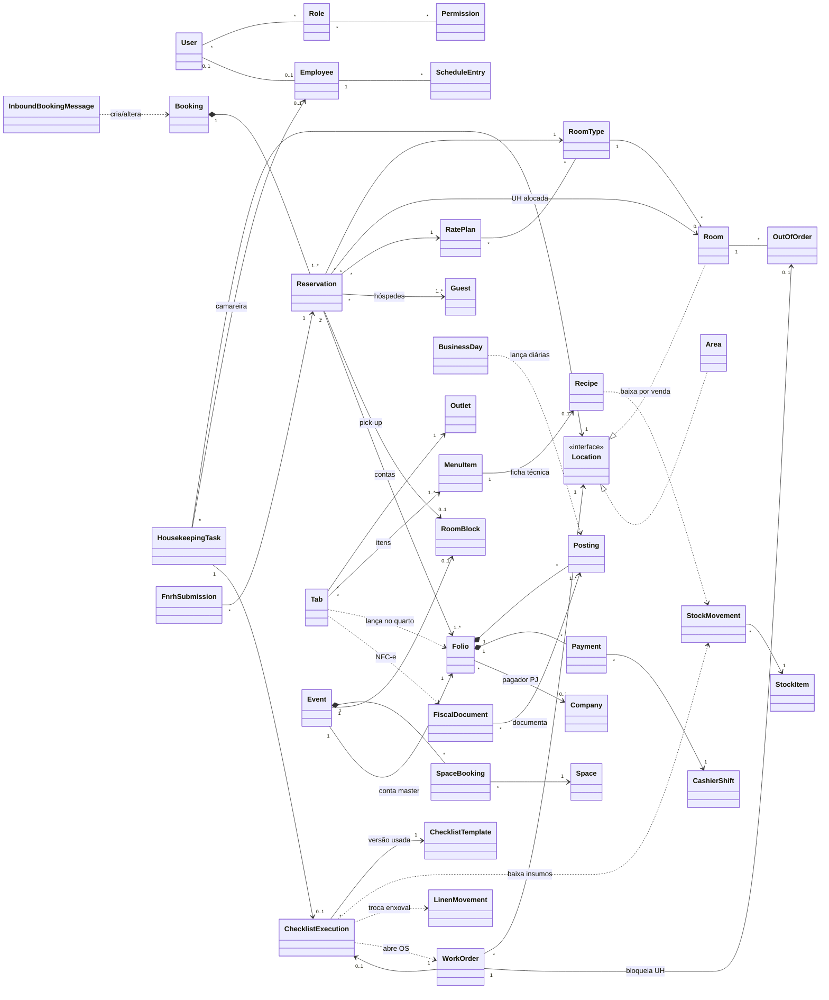
```mermaid
classDiagram
  direction LR

  class User
  class Role
  class Permission
  class Employee
  class ScheduleEntry
  class RoomType
  class Room
  class Area
  class Location {
    <<interface>>
  }
  class OutOfOrder
  class Guest
  class Company
  class RatePlan
  class Booking
  class Reservation
  class RoomBlock
  class Folio
  class Posting
  class Payment
  class CashierShift
  class FiscalDocument
  class BusinessDay
  class HousekeepingTask
  class ChecklistTemplate
  class ChecklistExecution
  class WorkOrder
  class StockItem
  class StockMovement
  class LinenMovement
  class Outlet
  class Tab
  class MenuItem
  class Recipe
  class Event
  class Space
  class SpaceBooking
  class FnrhSubmission
  class InboundBookingMessage

  User "*" -- "*" Role
  Role "*" -- "*" Permission
  User "0..1" -- "0..1" Employee
  Employee "1" -- "*" ScheduleEntry

  Location <|.. Room
  Location <|.. Area
  RoomType "1" -- "*" Room
  Room "1" -- "*" OutOfOrder

  RatePlan "*" -- "*" RoomType
  Booking "1" *-- "1..*" Reservation
  Reservation "*" --> "1" RoomType
  Reservation "*" --> "0..1" Room : UH alocada
  Reservation "*" --> "1" RatePlan
  Reservation "*" --> "1..*" Guest : hóspedes
  Reservation "*" --> "0..1" RoomBlock : pick-up
  Reservation "1" --> "1..*" Folio : contas

  Folio "1" *-- "*" Posting
  Folio "1" *-- "*" Payment
  Folio "*" --> "0..1" Company : pagador PJ
  Payment "*" --> "1" CashierShift
  FiscalDocument "*" --> "1..*" Posting : documenta
  BusinessDay ..> Posting : lança diárias

  HousekeepingTask "*" --> "1" Location
  HousekeepingTask "*" --> "0..1" Employee : camareira
  HousekeepingTask "1" --> "0..1" ChecklistExecution
  WorkOrder "*" --> "1" Location
  WorkOrder "1" --> "0..1" OutOfOrder : bloqueia UH
  WorkOrder "1" --> "0..1" ChecklistExecution
  ChecklistExecution "*" --> "1" ChecklistTemplate : versão usada
  ChecklistExecution ..> StockMovement : baixa insumos
  ChecklistExecution ..> LinenMovement : troca enxoval
  ChecklistExecution ..> WorkOrder : abre OS
  StockMovement "*" --> "1" StockItem

  Tab "*" --> "1" Outlet
  Tab "*" --> "1..*" MenuItem : itens
  MenuItem "1" --> "0..1" Recipe : ficha técnica
  Recipe ..> StockMovement : baixa por venda
  Tab ..> Folio : lança no quarto
  Tab ..> FiscalDocument : NFC-e

  Event "1" *-- "*" SpaceBooking
  SpaceBooking "*" --> "1" Space
  Event "1" --> "0..1" RoomBlock
  Event "1" --> "1" Folio : conta master

  FnrhSubmission "*" --> "1" Reservation
  InboundBookingMessage ..> Booking : cria/altera
```

### 8.2 Detalhamento por contexto

#### 8.2.1 Acesso e auditoria

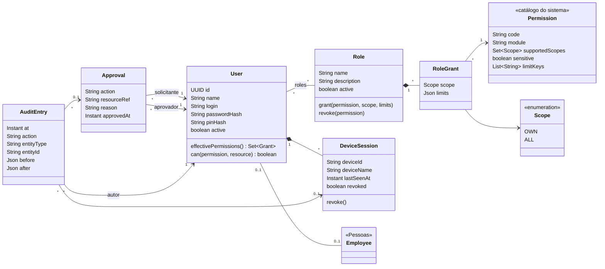
```mermaid
classDiagram
  direction LR

  class User {
    UUID id
    String name
    String login
    String passwordHash
    String pinHash
    boolean active
    effectivePermissions() Set~Grant~
    can(permission, resource) boolean
  }
  class Role {
    String name
    String description
    boolean active
    grant(permission, scope, limits)
    revoke(permission)
  }
  class Permission {
    <<catálogo do sistema>>
    String code
    String module
    Set~Scope~ supportedScopes
    boolean sensitive
    List~String~ limitKeys
  }
  class RoleGrant {
    Scope scope
    Json limits
  }
  class Scope {
    <<enumeration>>
    OWN
    ALL
  }
  class DeviceSession {
    String deviceId
    String deviceName
    Instant lastSeenAt
    boolean revoked
    revoke()
  }
  class Approval {
    String action
    String resourceRef
    String reason
    Instant approvedAt
  }
  class AuditEntry {
    Instant at
    String action
    String entityType
    String entityId
    Json before
    Json after
  }
  class Employee {
    <<Pessoas>>
  }

  User "*" -- "*" Role : roles
  Role "1" *-- "*" RoleGrant
  RoleGrant "*" --> "1" Permission
  RoleGrant --> Scope
  User "1" *-- "*" DeviceSession
  User "0..1" -- "0..1" Employee
  Approval "*" --> "1" User : solicitante
  Approval "*" --> "1" User : aprovador
  AuditEntry "*" --> "1" User : autor
  AuditEntry "*" --> "0..1" DeviceSession
  AuditEntry "*" --> "0..1" Approval
```

#### 8.2.2 Hotel, pessoas e escala

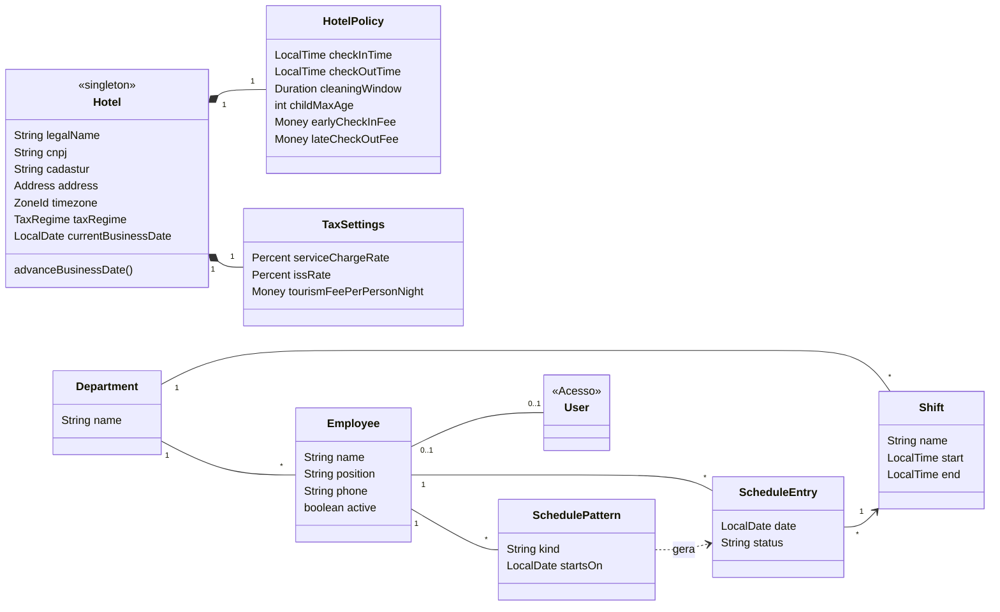
```mermaid
classDiagram
  direction LR

  class Hotel {
    <<singleton>>
    String legalName
    String cnpj
    String cadastur
    Address address
    ZoneId timezone
    TaxRegime taxRegime
    LocalDate currentBusinessDate
    advanceBusinessDate()
  }
  class HotelPolicy {
    LocalTime checkInTime
    LocalTime checkOutTime
    Duration cleaningWindow
    int childMaxAge
    Money earlyCheckInFee
    Money lateCheckOutFee
  }
  class TaxSettings {
    Percent serviceChargeRate
    Percent issRate
    Money tourismFeePerPersonNight
  }
  class Department {
    String name
  }
  class Employee {
    String name
    String position
    String phone
    boolean active
  }
  class Shift {
    String name
    LocalTime start
    LocalTime end
  }
  class SchedulePattern {
    String kind
    LocalDate startsOn
  }
  class ScheduleEntry {
    LocalDate date
    String status
  }
  class User {
    <<Acesso>>
  }

  Hotel "1" *-- "1" HotelPolicy
  Hotel "1" *-- "1" TaxSettings
  Department "1" -- "*" Employee
  Department "1" -- "*" Shift
  Employee "1" -- "*" SchedulePattern
  Employee "1" -- "*" ScheduleEntry
  ScheduleEntry "*" --> "1" Shift
  SchedulePattern ..> ScheduleEntry : gera
  Employee "0..1" -- "0..1" User
```

#### 8.2.3 UHs, áreas e status

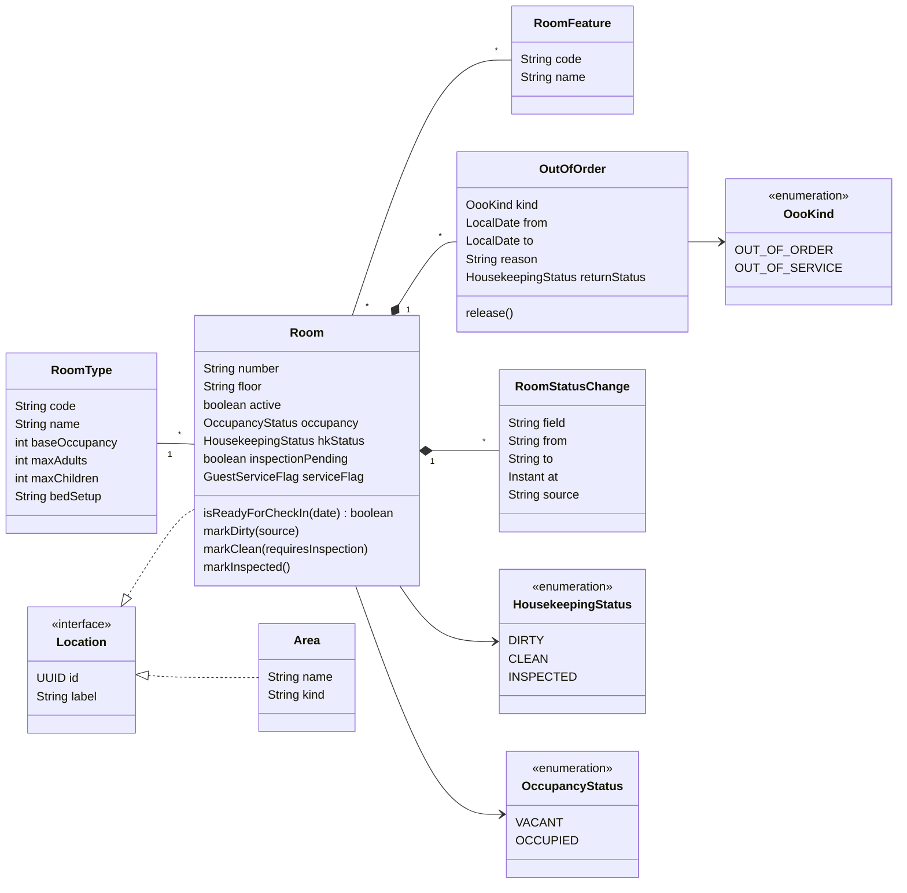
```mermaid
classDiagram
  direction LR

  class Location {
    <<interface>>
    UUID id
    String label
  }
  class RoomType {
    String code
    String name
    int baseOccupancy
    int maxAdults
    int maxChildren
    String bedSetup
  }
  class Room {
    String number
    String floor
    boolean active
    OccupancyStatus occupancy
    HousekeepingStatus hkStatus
    boolean inspectionPending
    GuestServiceFlag serviceFlag
    isReadyForCheckIn(date) boolean
    markDirty(source)
    markClean(requiresInspection)
    markInspected()
  }
  class RoomFeature {
    String code
    String name
  }
  class Area {
    String name
    String kind
  }
  class OutOfOrder {
    OooKind kind
    LocalDate from
    LocalDate to
    String reason
    HousekeepingStatus returnStatus
    release()
  }
  class RoomStatusChange {
    String field
    String from
    String to
    Instant at
    String source
  }
  class HousekeepingStatus {
    <<enumeration>>
    DIRTY
    CLEAN
    INSPECTED
  }
  class OccupancyStatus {
    <<enumeration>>
    VACANT
    OCCUPIED
  }
  class OooKind {
    <<enumeration>>
    OUT_OF_ORDER
    OUT_OF_SERVICE
  }

  Location <|.. Room
  Location <|.. Area
  RoomType "1" -- "*" Room
  Room "*" -- "*" RoomFeature
  Room "1" *-- "*" OutOfOrder
  Room "1" *-- "*" RoomStatusChange
  Room --> HousekeepingStatus
  Room --> OccupancyStatus
  OutOfOrder --> OooKind
```

#### 8.2.4 Hóspedes e clientes

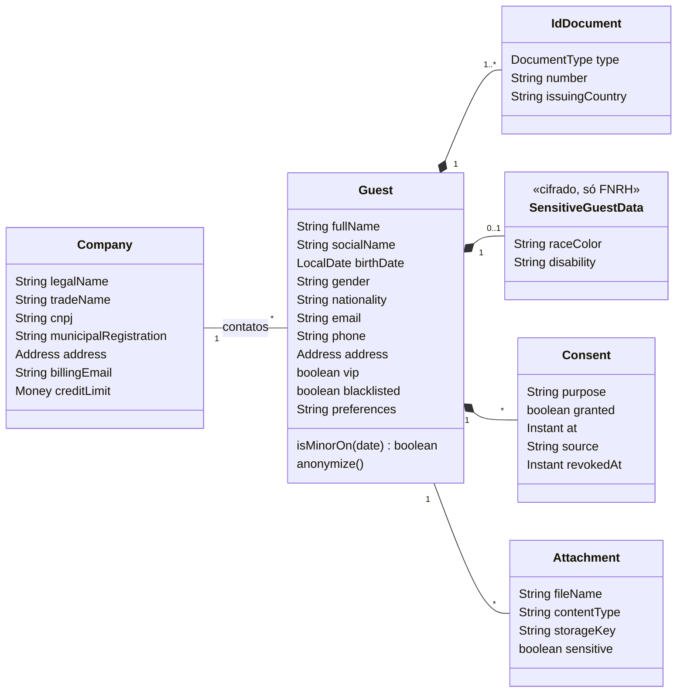
```mermaid
classDiagram
  direction LR

  class Guest {
    String fullName
    String socialName
    LocalDate birthDate
    String gender
    String nationality
    String email
    String phone
    Address address
    boolean vip
    boolean blacklisted
    String preferences
    isMinorOn(date) boolean
    anonymize()
  }
  class IdDocument {
    DocumentType type
    String number
    String issuingCountry
  }
  class SensitiveGuestData {
    <<cifrado, só FNRH>>
    String raceColor
    String disability
  }
  class Company {
    String legalName
    String tradeName
    String cnpj
    String municipalRegistration
    Address address
    String billingEmail
    Money creditLimit
  }
  class Consent {
    String purpose
    boolean granted
    Instant at
    String source
    Instant revokedAt
  }
  class Attachment {
    String fileName
    String contentType
    String storageKey
    boolean sensitive
  }

  Guest "1" *-- "1..*" IdDocument
  Guest "1" *-- "0..1" SensitiveGuestData
  Guest "1" *-- "*" Consent
  Guest "1" -- "*" Attachment
  Company "1" -- "*" Guest : contatos
```

#### 8.2.5 Tarifas

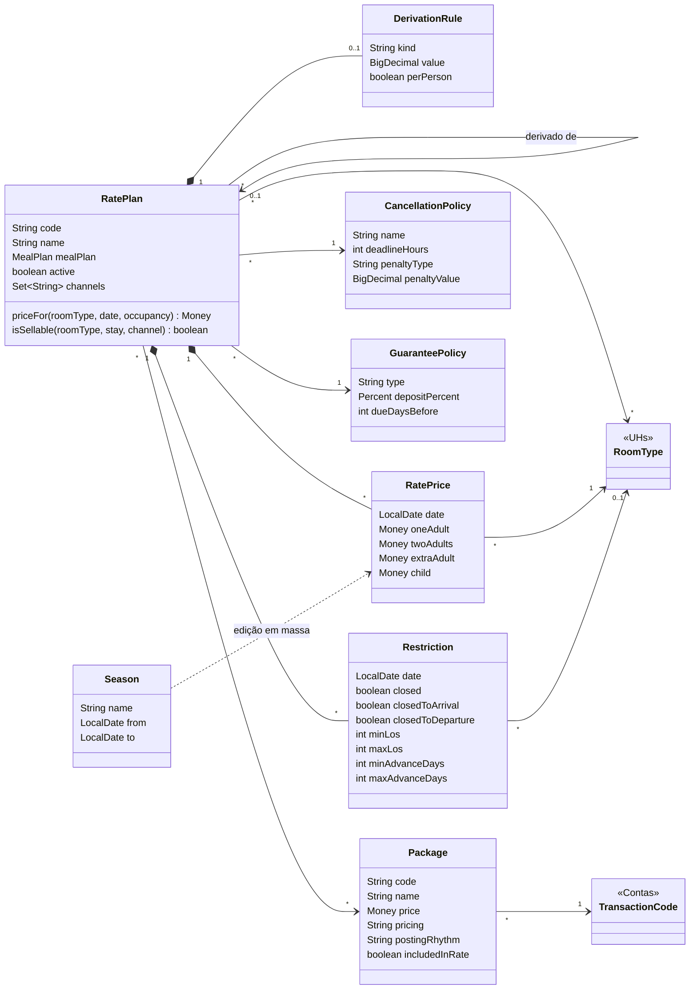
```mermaid
classDiagram
  direction LR

  class RatePlan {
    String code
    String name
    MealPlan mealPlan
    boolean active
    Set~String~ channels
    priceFor(roomType, date, occupancy) Money
    isSellable(roomType, stay, channel) boolean
  }
  class DerivationRule {
    String kind
    BigDecimal value
    boolean perPerson
  }
  class RatePrice {
    LocalDate date
    Money oneAdult
    Money twoAdults
    Money extraAdult
    Money child
  }
  class Restriction {
    LocalDate date
    boolean closed
    boolean closedToArrival
    boolean closedToDeparture
    int minLos
    int maxLos
    int minAdvanceDays
    int maxAdvanceDays
  }
  class Package {
    String code
    String name
    Money price
    String pricing
    String postingRhythm
    boolean includedInRate
  }
  class CancellationPolicy {
    String name
    int deadlineHours
    String penaltyType
    BigDecimal penaltyValue
  }
  class GuaranteePolicy {
    String type
    Percent depositPercent
    int dueDaysBefore
  }
  class Season {
    String name
    LocalDate from
    LocalDate to
  }
  class RoomType {
    <<UHs>>
  }
  class TransactionCode {
    <<Contas>>
  }

  RatePlan "*" --> "0..1" RatePlan : derivado de
  RatePlan "1" *-- "0..1" DerivationRule
  RatePlan "1" *-- "*" RatePrice
  RatePlan "1" *-- "*" Restriction
  RatePlan "*" --> "*" Package
  RatePlan "*" --> "1" CancellationPolicy
  RatePlan "*" --> "1" GuaranteePolicy
  RatePlan "*" --> "*" RoomType
  RatePrice "*" --> "1" RoomType
  Restriction "*" --> "0..1" RoomType
  Package "*" --> "1" TransactionCode
  Season ..> RatePrice : edição em massa
```

#### 8.2.6 Reservas e recepção

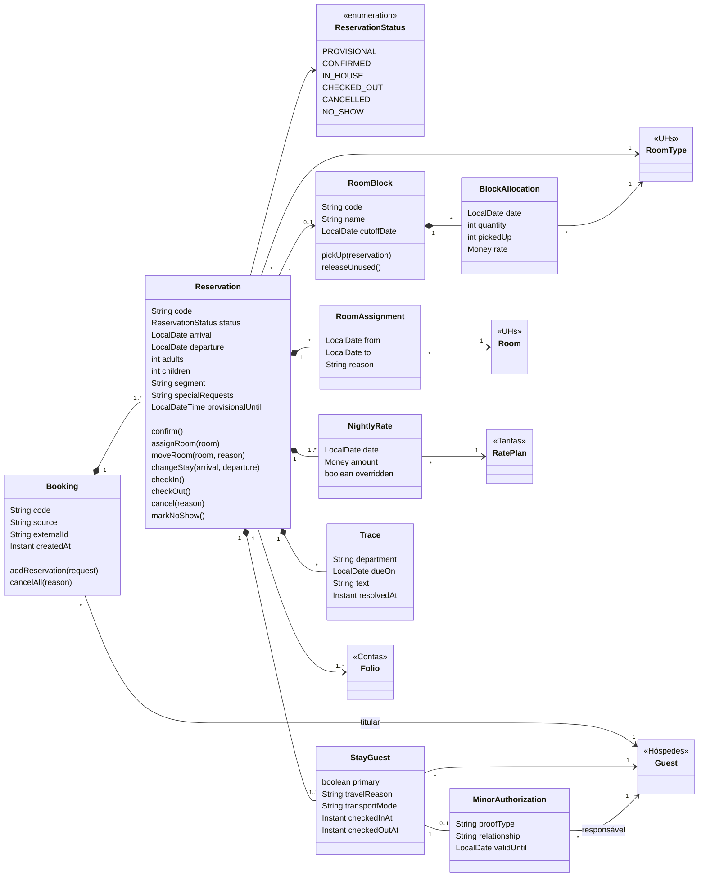
```mermaid
classDiagram
  direction LR

  class Booking {
    String code
    String source
    String externalId
    Instant createdAt
    addReservation(request)
    cancelAll(reason)
  }
  class Reservation {
    String code
    ReservationStatus status
    LocalDate arrival
    LocalDate departure
    int adults
    int children
    String segment
    String specialRequests
    LocalDateTime provisionalUntil
    confirm()
    assignRoom(room)
    moveRoom(room, reason)
    changeStay(arrival, departure)
    checkIn()
    checkOut()
    cancel(reason)
    markNoShow()
  }
  class ReservationStatus {
    <<enumeration>>
    PROVISIONAL
    CONFIRMED
    IN_HOUSE
    CHECKED_OUT
    CANCELLED
    NO_SHOW
  }
  class StayGuest {
    boolean primary
    String travelReason
    String transportMode
    Instant checkedInAt
    Instant checkedOutAt
  }
  class MinorAuthorization {
    String proofType
    String relationship
    LocalDate validUntil
  }
  class NightlyRate {
    LocalDate date
    Money amount
    boolean overridden
  }
  class RoomAssignment {
    LocalDate from
    LocalDate to
    String reason
  }
  class RoomBlock {
    String code
    String name
    LocalDate cutoffDate
    pickUp(reservation)
    releaseUnused()
  }
  class BlockAllocation {
    LocalDate date
    int quantity
    int pickedUp
    Money rate
  }
  class Trace {
    String department
    LocalDate dueOn
    String text
    Instant resolvedAt
  }
  class Guest {
    <<Hóspedes>>
  }
  class Room {
    <<UHs>>
  }
  class RoomType {
    <<UHs>>
  }
  class RatePlan {
    <<Tarifas>>
  }
  class Folio {
    <<Contas>>
  }

  Booking "1" *-- "1..*" Reservation
  Booking "*" --> "1" Guest : titular
  Reservation --> ReservationStatus
  Reservation "1" *-- "1..*" StayGuest
  StayGuest "*" --> "1" Guest
  StayGuest "1" -- "0..1" MinorAuthorization
  MinorAuthorization "*" --> "1" Guest : responsável
  Reservation "1" *-- "1..*" NightlyRate
  NightlyRate "*" --> "1" RatePlan
  Reservation "1" *-- "*" RoomAssignment
  RoomAssignment "*" --> "1" Room
  Reservation "*" --> "1" RoomType
  Reservation "*" --> "0..1" RoomBlock
  RoomBlock "1" *-- "*" BlockAllocation
  BlockAllocation "*" --> "1" RoomType
  Reservation "1" *-- "*" Trace
  Reservation "1" --> "1..*" Folio
```

#### 8.2.7 Contas, caixa e pagamentos

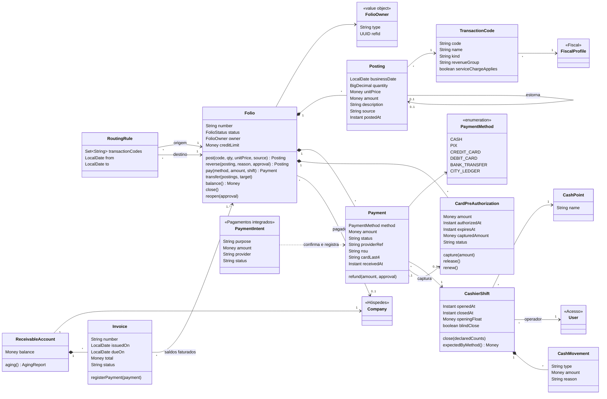
```mermaid
classDiagram
  direction LR

  class Folio {
    String number
    FolioStatus status
    FolioOwner owner
    Money creditLimit
    post(code, qty, unitPrice, source) Posting
    reverse(posting, reason, approval) Posting
    pay(method, amount, shift) Payment
    transfer(postings, target)
    balance() Money
    close()
    reopen(approval)
  }
  class FolioOwner {
    <<value object>>
    String type
    UUID refId
  }
  class Posting {
    LocalDate businessDate
    BigDecimal quantity
    Money unitPrice
    Money amount
    String description
    String source
    Instant postedAt
  }
  class TransactionCode {
    String code
    String name
    String kind
    String revenueGroup
    boolean serviceChargeApplies
  }
  class RoutingRule {
    Set~String~ transactionCodes
    LocalDate from
    LocalDate to
  }
  class Payment {
    PaymentMethod method
    Money amount
    String status
    String providerRef
    String nsu
    String cardLast4
    Instant receivedAt
    refund(amount, approval)
  }
  class PaymentMethod {
    <<enumeration>>
    CASH
    PIX
    CREDIT_CARD
    DEBIT_CARD
    BANK_TRANSFER
    CITY_LEDGER
  }
  class CardPreAuthorization {
    Money amount
    Instant authorizedAt
    Instant expiresAt
    Money capturedAmount
    String status
    capture(amount)
    release()
    renew()
  }
  class CashPoint {
    String name
  }
  class CashierShift {
    Instant openedAt
    Instant closedAt
    Money openingFloat
    boolean blindClose
    close(declaredCounts)
    expectedByMethod() Money
  }
  class CashMovement {
    String type
    Money amount
    String reason
  }
  class ReceivableAccount {
    Money balance
    aging() AgingReport
  }
  class Invoice {
    String number
    LocalDate issuedOn
    LocalDate dueOn
    Money total
    String status
    registerPayment(payment)
  }
  class PaymentIntent {
    <<Pagamentos integrados>>
    String purpose
    Money amount
    String provider
    String status
  }
  class Company {
    <<Hóspedes>>
  }
  class User {
    <<Acesso>>
  }
  class FiscalProfile {
    <<Fiscal>>
  }

  Folio --> FolioOwner
  Folio "1" *-- "*" Posting
  Folio "1" *-- "*" Payment
  Folio "1" *-- "*" CardPreAuthorization
  Folio "*" --> "0..1" Company : pagador
  Posting "*" --> "1" TransactionCode
  Posting "0..1" --> "0..1" Posting : estorna
  TransactionCode "*" --> "1" FiscalProfile
  RoutingRule "*" --> "1" Folio : origem
  RoutingRule "*" --> "1" Folio : destino
  Payment --> PaymentMethod
  Payment "*" --> "1" CashierShift
  Payment "0..1" --> "0..1" CardPreAuthorization : captura
  PaymentIntent ..> Payment : confirma e registra
  CashierShift "*" --> "1" CashPoint
  CashierShift "*" --> "1" User : operador
  CashierShift "1" *-- "*" CashMovement
  ReceivableAccount "1" --> "1" Company
  ReceivableAccount "1" *-- "*" Invoice
  Invoice "*" --> "1..*" Folio : saldos faturados
```

#### 8.2.8 Pagamentos integrados e fiscal

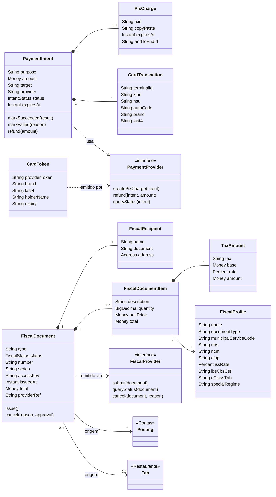
```mermaid
classDiagram
  direction LR

  class PaymentIntent {
    String purpose
    Money amount
    String target
    String provider
    IntentStatus status
    Instant expiresAt
    markSucceeded(result)
    markFailed(reason)
    refund(amount)
  }
  class PixCharge {
    String txid
    String copyPaste
    Instant expiresAt
    String endToEndId
  }
  class CardTransaction {
    String terminalId
    String kind
    String nsu
    String authCode
    String brand
    String last4
  }
  class CardToken {
    String providerToken
    String brand
    String last4
    String holderName
    String expiry
  }
  class PaymentProvider {
    <<interface>>
    createPixCharge(intent)
    refund(intent, amount)
    queryStatus(intent)
  }
  class FiscalProfile {
    String name
    String documentType
    String municipalServiceCode
    String nbs
    String ncm
    String cfop
    Percent issRate
    String ibsCbsCst
    String cClassTrib
    String specialRegime
  }
  class FiscalDocument {
    String type
    FiscalStatus status
    String number
    String series
    String accessKey
    Instant issuedAt
    Money total
    String providerRef
    issue()
    cancel(reason, approval)
  }
  class FiscalRecipient {
    String name
    String document
    Address address
  }
  class FiscalDocumentItem {
    String description
    BigDecimal quantity
    Money unitPrice
    Money total
  }
  class TaxAmount {
    String tax
    Money base
    Percent rate
    Money amount
  }
  class FiscalProvider {
    <<interface>>
    submit(document)
    queryStatus(document)
    cancel(document, reason)
  }
  class Posting {
    <<Contas>>
  }
  class Tab {
    <<Restaurante>>
  }

  PaymentIntent "1" *-- "0..1" PixCharge
  PaymentIntent "1" *-- "*" CardTransaction
  PaymentIntent ..> PaymentProvider : usa
  CardToken ..> PaymentProvider : emitido por
  FiscalDocument "1" *-- "1" FiscalRecipient
  FiscalDocument "1" *-- "1..*" FiscalDocumentItem
  FiscalDocumentItem "1" *-- "*" TaxAmount
  FiscalDocumentItem "*" --> "1" FiscalProfile
  FiscalDocument ..> FiscalProvider : emitido via
  FiscalDocument "*" --> "*" Posting : origem
  FiscalDocument "0..1" --> "0..1" Tab : origem
```

#### 8.2.9 Fechamento do dia e estatísticas

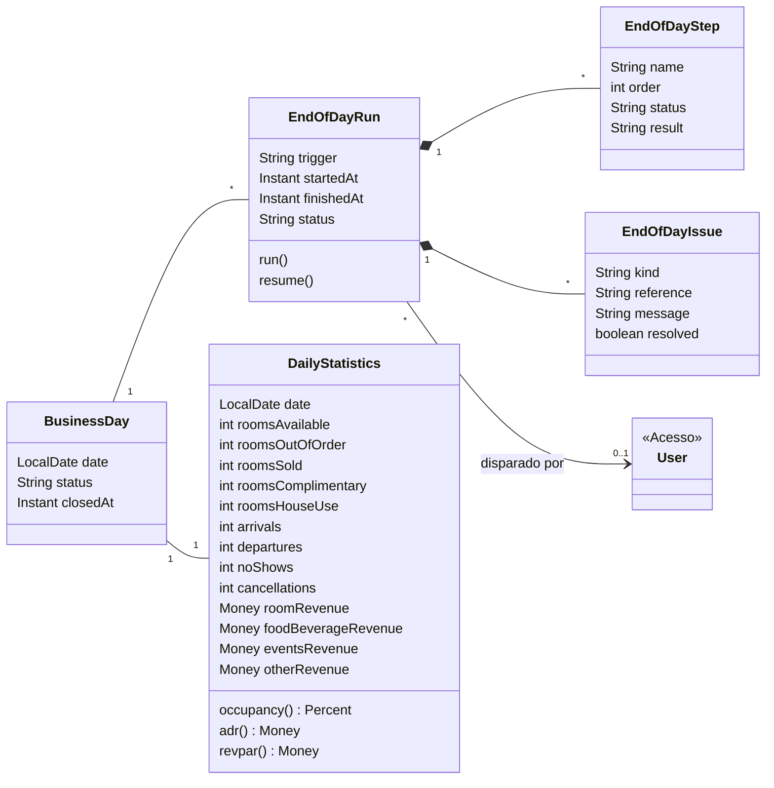
```mermaid
classDiagram
  direction LR

  class BusinessDay {
    LocalDate date
    String status
    Instant closedAt
  }
  class EndOfDayRun {
    String trigger
    Instant startedAt
    Instant finishedAt
    String status
    run()
    resume()
  }
  class EndOfDayStep {
    String name
    int order
    String status
    String result
  }
  class EndOfDayIssue {
    String kind
    String reference
    String message
    boolean resolved
  }
  class DailyStatistics {
    LocalDate date
    int roomsAvailable
    int roomsOutOfOrder
    int roomsSold
    int roomsComplimentary
    int roomsHouseUse
    int arrivals
    int departures
    int noShows
    int cancellations
    Money roomRevenue
    Money foodBeverageRevenue
    Money eventsRevenue
    Money otherRevenue
    occupancy() Percent
    adr() Money
    revpar() Money
  }
  class User {
    <<Acesso>>
  }

  BusinessDay "1" -- "*" EndOfDayRun
  EndOfDayRun "1" *-- "*" EndOfDayStep
  EndOfDayRun "1" *-- "*" EndOfDayIssue
  EndOfDayRun "*" --> "0..1" User : disparado por
  BusinessDay "1" -- "1" DailyStatistics
```

#### 8.2.10 Governança

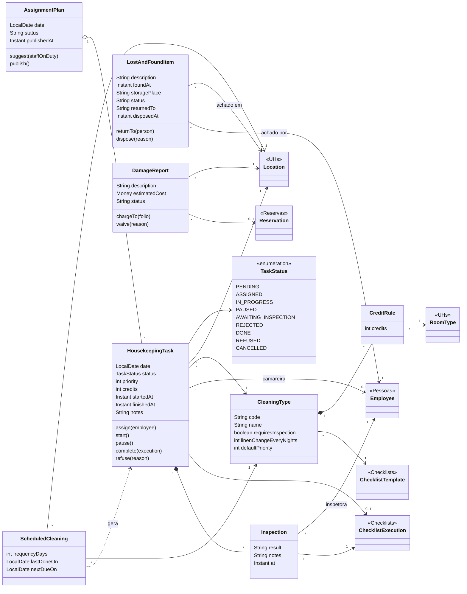
```mermaid
classDiagram
  direction LR

  class CleaningType {
    String code
    String name
    boolean requiresInspection
    int linenChangeEveryNights
    int defaultPriority
  }
  class CreditRule {
    int credits
  }
  class HousekeepingTask {
    LocalDate date
    TaskStatus status
    int priority
    int credits
    Instant startedAt
    Instant finishedAt
    String notes
    assign(employee)
    start()
    pause()
    complete(execution)
    refuse(reason)
  }
  class TaskStatus {
    <<enumeration>>
    PENDING
    ASSIGNED
    IN_PROGRESS
    PAUSED
    AWAITING_INSPECTION
    REJECTED
    DONE
    REFUSED
    CANCELLED
  }
  class AssignmentPlan {
    LocalDate date
    String status
    Instant publishedAt
    suggest(staffOnDuty)
    publish()
  }
  class Inspection {
    String result
    String notes
    Instant at
  }
  class ScheduledCleaning {
    int frequencyDays
    LocalDate lastDoneOn
    LocalDate nextDueOn
  }
  class LostAndFoundItem {
    String description
    Instant foundAt
    String storagePlace
    String status
    String returnedTo
    Instant disposedAt
    returnTo(person)
    dispose(reason)
  }
  class DamageReport {
    String description
    Money estimatedCost
    String status
    chargeTo(folio)
    waive(reason)
  }
  class Location {
    <<UHs>>
  }
  class RoomType {
    <<UHs>>
  }
  class Employee {
    <<Pessoas>>
  }
  class ChecklistTemplate {
    <<Checklists>>
  }
  class ChecklistExecution {
    <<Checklists>>
  }
  class Reservation {
    <<Reservas>>
  }

  CleaningType "1" *-- "*" CreditRule
  CreditRule "*" --> "1" RoomType
  CleaningType "*" --> "1" ChecklistTemplate
  HousekeepingTask --> TaskStatus
  HousekeepingTask "*" --> "1" Location
  HousekeepingTask "*" --> "1" CleaningType
  HousekeepingTask "*" --> "0..1" Employee : camareira
  HousekeepingTask "1" --> "0..1" ChecklistExecution
  AssignmentPlan "1" o-- "*" HousekeepingTask
  HousekeepingTask "1" *-- "*" Inspection
  Inspection "*" --> "1" Employee : inspetora
  Inspection "1" --> "1" ChecklistExecution
  ScheduledCleaning "*" --> "1" Location
  ScheduledCleaning "*" --> "1" CleaningType
  ScheduledCleaning ..> HousekeepingTask : gera
  LostAndFoundItem "*" --> "1" Location : achado em
  LostAndFoundItem "*" --> "1" Employee : achado por
  DamageReport "*" --> "1" Location
  DamageReport "*" --> "0..1" Reservation
```

#### 8.2.11 Checklists dinâmicos

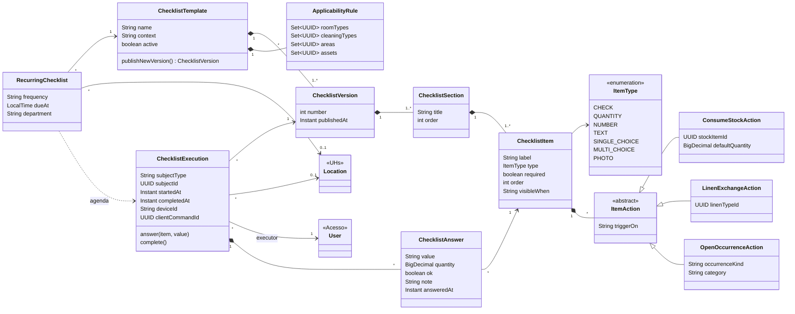
```mermaid
classDiagram
  direction LR

  class ChecklistTemplate {
    String name
    String context
    boolean active
    publishNewVersion() ChecklistVersion
  }
  class ChecklistVersion {
    int number
    Instant publishedAt
  }
  class ChecklistSection {
    String title
    int order
  }
  class ChecklistItem {
    String label
    ItemType type
    boolean required
    int order
    String visibleWhen
  }
  class ItemType {
    <<enumeration>>
    CHECK
    QUANTITY
    NUMBER
    TEXT
    SINGLE_CHOICE
    MULTI_CHOICE
    PHOTO
  }
  class ItemAction {
    <<abstract>>
    String triggerOn
  }
  class ConsumeStockAction {
    UUID stockItemId
    BigDecimal defaultQuantity
  }
  class LinenExchangeAction {
    UUID linenTypeId
  }
  class OpenOccurrenceAction {
    String occurrenceKind
    String category
  }
  class ApplicabilityRule {
    Set~UUID~ roomTypes
    Set~UUID~ cleaningTypes
    Set~UUID~ areas
    Set~UUID~ assets
  }
  class ChecklistExecution {
    String subjectType
    UUID subjectId
    Instant startedAt
    Instant completedAt
    String deviceId
    UUID clientCommandId
    answer(item, value)
    complete()
  }
  class ChecklistAnswer {
    String value
    BigDecimal quantity
    boolean ok
    String note
    Instant answeredAt
  }
  class RecurringChecklist {
    String frequency
    LocalTime dueAt
    String department
  }
  class Location {
    <<UHs>>
  }
  class User {
    <<Acesso>>
  }

  ChecklistTemplate "1" *-- "1..*" ChecklistVersion
  ChecklistTemplate "1" *-- "*" ApplicabilityRule
  ChecklistVersion "1" *-- "1..*" ChecklistSection
  ChecklistSection "1" *-- "1..*" ChecklistItem
  ChecklistItem --> ItemType
  ChecklistItem "1" *-- "*" ItemAction
  ItemAction <|-- ConsumeStockAction
  ItemAction <|-- LinenExchangeAction
  ItemAction <|-- OpenOccurrenceAction
  ChecklistExecution "*" --> "1" ChecklistVersion
  ChecklistExecution "*" --> "0..1" Location
  ChecklistExecution "*" --> "1" User : executor
  ChecklistExecution "1" *-- "*" ChecklistAnswer
  ChecklistAnswer "*" --> "1" ChecklistItem
  RecurringChecklist "*" --> "1" ChecklistTemplate
  RecurringChecklist "*" --> "0..1" Location
  RecurringChecklist ..> ChecklistExecution : agenda
```

Ao concluir uma execução, o contexto de checklists publica o evento `ChecklistCompleted` com as respostas que têm ações. Cada contexto interessado reage à sua parte:

- Estoque cuida de `ConsumeStock`.
- Rouparia cuida de `LinenExchange`.
- Manutenção e Governança cuidam de `OpenOccurrence`.

O motor de checklists não conhece estoque, rouparia nem manutenção.

#### 8.2.12 Manutenção

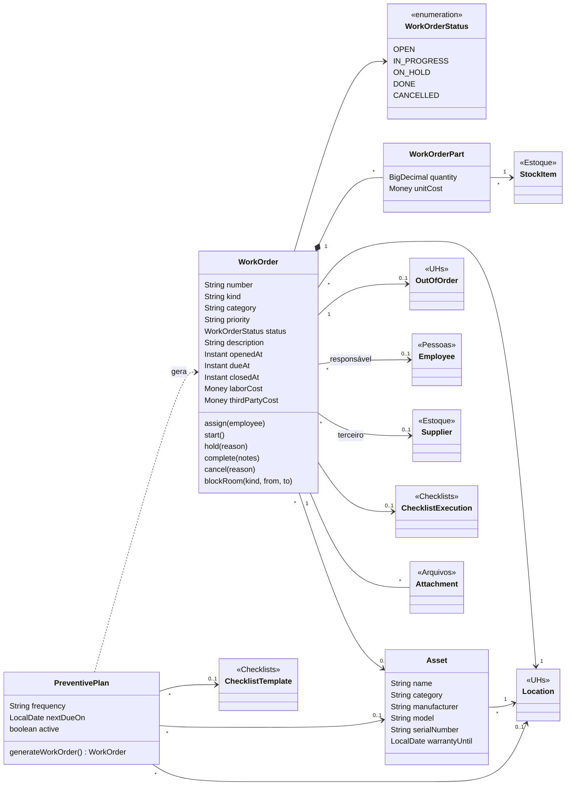
```mermaid
classDiagram
  direction LR

  class WorkOrder {
    String number
    String kind
    String category
    String priority
    WorkOrderStatus status
    String description
    Instant openedAt
    Instant dueAt
    Instant closedAt
    Money laborCost
    Money thirdPartyCost
    assign(employee)
    start()
    hold(reason)
    complete(notes)
    cancel(reason)
    blockRoom(kind, from, to)
  }
  class WorkOrderStatus {
    <<enumeration>>
    OPEN
    IN_PROGRESS
    ON_HOLD
    DONE
    CANCELLED
  }
  class WorkOrderPart {
    BigDecimal quantity
    Money unitCost
  }
  class Asset {
    String name
    String category
    String manufacturer
    String model
    String serialNumber
    LocalDate warrantyUntil
  }
  class PreventivePlan {
    String frequency
    LocalDate nextDueOn
    boolean active
    generateWorkOrder() WorkOrder
  }
  class Location {
    <<UHs>>
  }
  class OutOfOrder {
    <<UHs>>
  }
  class Employee {
    <<Pessoas>>
  }
  class Supplier {
    <<Estoque>>
  }
  class StockItem {
    <<Estoque>>
  }
  class ChecklistTemplate {
    <<Checklists>>
  }
  class ChecklistExecution {
    <<Checklists>>
  }
  class Attachment {
    <<Arquivos>>
  }

  WorkOrder --> WorkOrderStatus
  WorkOrder "*" --> "1" Location
  WorkOrder "*" --> "0..1" Asset
  WorkOrder "*" --> "0..1" Employee : responsável
  WorkOrder "*" --> "0..1" Supplier : terceiro
  WorkOrder "1" --> "0..1" OutOfOrder
  WorkOrder "1" --> "0..1" ChecklistExecution
  WorkOrder "1" *-- "*" WorkOrderPart
  WorkOrderPart "*" --> "1" StockItem
  WorkOrder "1" -- "*" Attachment
  Asset "*" --> "1" Location
  PreventivePlan "*" --> "0..1" Asset
  PreventivePlan "*" --> "0..1" Location
  PreventivePlan "*" --> "0..1" ChecklistTemplate
  PreventivePlan ..> WorkOrder : gera
```

#### 8.2.13 Estoque e compras

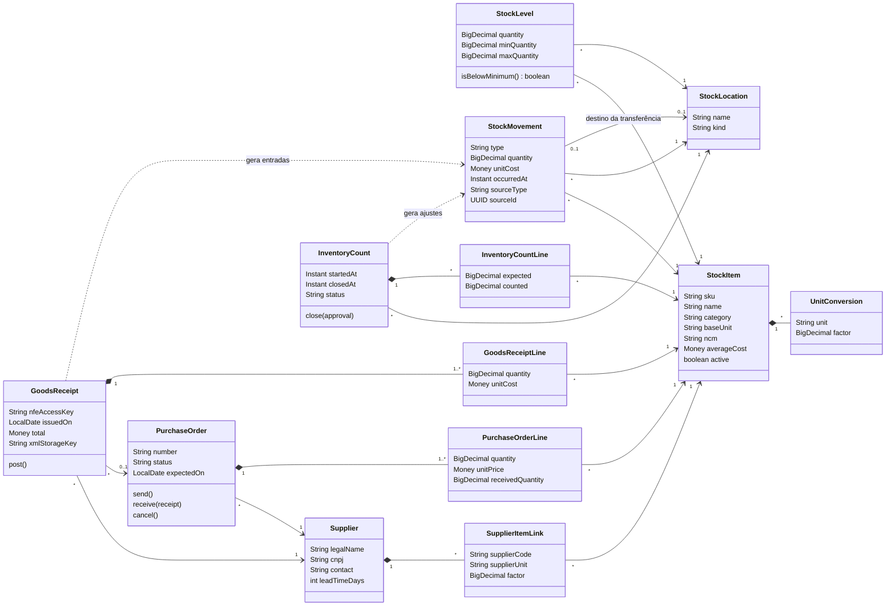
```mermaid
classDiagram
  direction LR

  class StockItem {
    String sku
    String name
    String category
    String baseUnit
    String ncm
    Money averageCost
    boolean active
  }
  class UnitConversion {
    String unit
    BigDecimal factor
  }
  class StockLocation {
    String name
    String kind
  }
  class StockLevel {
    BigDecimal quantity
    BigDecimal minQuantity
    BigDecimal maxQuantity
    isBelowMinimum() boolean
  }
  class StockMovement {
    String type
    BigDecimal quantity
    Money unitCost
    Instant occurredAt
    String sourceType
    UUID sourceId
  }
  class Supplier {
    String legalName
    String cnpj
    String contact
    int leadTimeDays
  }
  class SupplierItemLink {
    String supplierCode
    String supplierUnit
    BigDecimal factor
  }
  class PurchaseOrder {
    String number
    String status
    LocalDate expectedOn
    send()
    receive(receipt)
    cancel()
  }
  class PurchaseOrderLine {
    BigDecimal quantity
    Money unitPrice
    BigDecimal receivedQuantity
  }
  class GoodsReceipt {
    String nfeAccessKey
    LocalDate issuedOn
    Money total
    String xmlStorageKey
    post()
  }
  class GoodsReceiptLine {
    BigDecimal quantity
    Money unitCost
  }
  class InventoryCount {
    Instant startedAt
    Instant closedAt
    String status
    close(approval)
  }
  class InventoryCountLine {
    BigDecimal expected
    BigDecimal counted
  }

  StockItem "1" *-- "*" UnitConversion
  StockLevel "*" --> "1" StockItem
  StockLevel "*" --> "1" StockLocation
  StockMovement "*" --> "1" StockItem
  StockMovement "*" --> "1" StockLocation
  StockMovement "0..1" --> "0..1" StockLocation : destino da transferência
  Supplier "1" *-- "*" SupplierItemLink
  SupplierItemLink "*" --> "1" StockItem
  PurchaseOrder "*" --> "1" Supplier
  PurchaseOrder "1" *-- "1..*" PurchaseOrderLine
  PurchaseOrderLine "*" --> "1" StockItem
  GoodsReceipt "*" --> "1" Supplier
  GoodsReceipt "*" --> "0..1" PurchaseOrder
  GoodsReceipt "1" *-- "1..*" GoodsReceiptLine
  GoodsReceiptLine "*" --> "1" StockItem
  GoodsReceipt ..> StockMovement : gera entradas
  InventoryCount "*" --> "1" StockLocation
  InventoryCount "1" *-- "*" InventoryCountLine
  InventoryCountLine "*" --> "1" StockItem
  InventoryCount ..> StockMovement : gera ajustes
```

#### 8.2.14 Rouparia e lavanderia

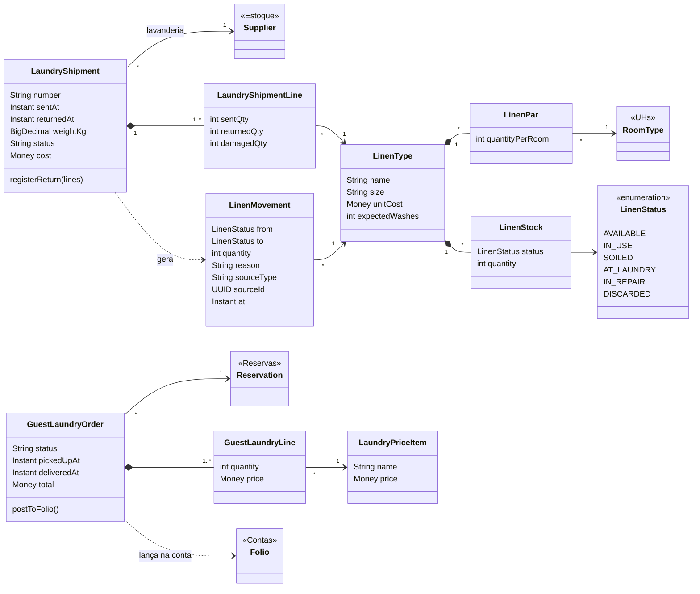
```mermaid
classDiagram
  direction LR

  class LinenType {
    String name
    String size
    Money unitCost
    int expectedWashes
  }
  class LinenPar {
    int quantityPerRoom
  }
  class LinenStock {
    LinenStatus status
    int quantity
  }
  class LinenStatus {
    <<enumeration>>
    AVAILABLE
    IN_USE
    SOILED
    AT_LAUNDRY
    IN_REPAIR
    DISCARDED
  }
  class LinenMovement {
    LinenStatus from
    LinenStatus to
    int quantity
    String reason
    String sourceType
    UUID sourceId
    Instant at
  }
  class LaundryShipment {
    String number
    Instant sentAt
    Instant returnedAt
    BigDecimal weightKg
    String status
    Money cost
    registerReturn(lines)
  }
  class LaundryShipmentLine {
    int sentQty
    int returnedQty
    int damagedQty
  }
  class GuestLaundryOrder {
    String status
    Instant pickedUpAt
    Instant deliveredAt
    Money total
    postToFolio()
  }
  class GuestLaundryLine {
    int quantity
    Money price
  }
  class LaundryPriceItem {
    String name
    Money price
  }
  class RoomType {
    <<UHs>>
  }
  class Supplier {
    <<Estoque>>
  }
  class Reservation {
    <<Reservas>>
  }
  class Folio {
    <<Contas>>
  }

  LinenType "1" *-- "*" LinenPar
  LinenPar "*" --> "1" RoomType
  LinenType "1" *-- "*" LinenStock
  LinenStock --> LinenStatus
  LinenMovement "*" --> "1" LinenType
  LaundryShipment "*" --> "1" Supplier : lavanderia
  LaundryShipment "1" *-- "1..*" LaundryShipmentLine
  LaundryShipmentLine "*" --> "1" LinenType
  LaundryShipment ..> LinenMovement : gera
  GuestLaundryOrder "*" --> "1" Reservation
  GuestLaundryOrder "1" *-- "1..*" GuestLaundryLine
  GuestLaundryLine "*" --> "1" LaundryPriceItem
  GuestLaundryOrder ..> Folio : lança na conta
```

#### 8.2.15 Restaurante e bar

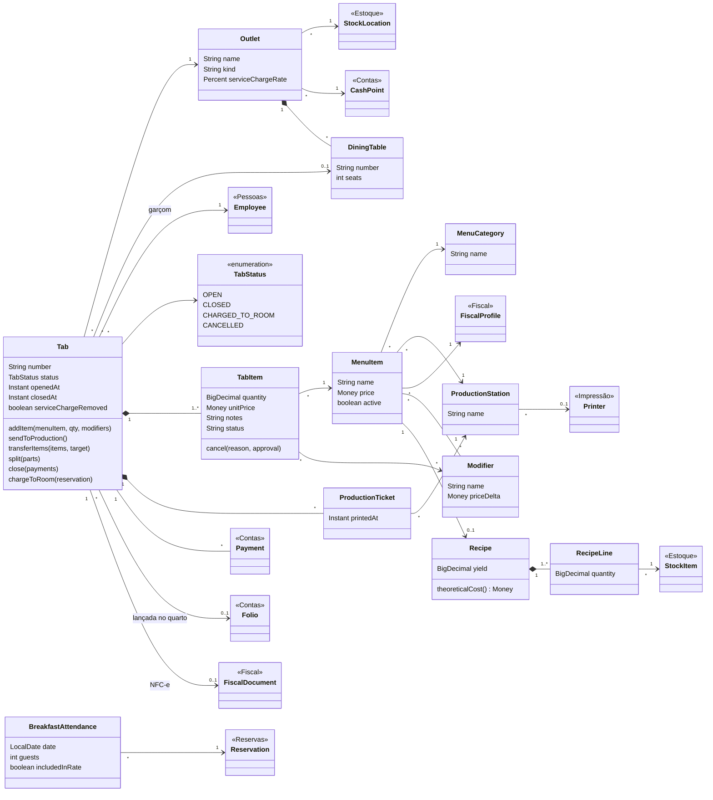
```mermaid
classDiagram
  direction LR

  class Outlet {
    String name
    String kind
    Percent serviceChargeRate
  }
  class ProductionStation {
    String name
  }
  class MenuCategory {
    String name
  }
  class MenuItem {
    String name
    Money price
    boolean active
  }
  class Modifier {
    String name
    Money priceDelta
  }
  class Recipe {
    BigDecimal yield
    theoreticalCost() Money
  }
  class RecipeLine {
    BigDecimal quantity
  }
  class DiningTable {
    String number
    int seats
  }
  class Tab {
    String number
    TabStatus status
    Instant openedAt
    Instant closedAt
    boolean serviceChargeRemoved
    addItem(menuItem, qty, modifiers)
    sendToProduction()
    transferItems(items, target)
    split(parts)
    close(payments)
    chargeToRoom(reservation)
  }
  class TabStatus {
    <<enumeration>>
    OPEN
    CLOSED
    CHARGED_TO_ROOM
    CANCELLED
  }
  class TabItem {
    BigDecimal quantity
    Money unitPrice
    String notes
    String status
    cancel(reason, approval)
  }
  class ProductionTicket {
    Instant printedAt
  }
  class BreakfastAttendance {
    LocalDate date
    int guests
    boolean includedInRate
  }
  class StockItem {
    <<Estoque>>
  }
  class StockLocation {
    <<Estoque>>
  }
  class CashPoint {
    <<Contas>>
  }
  class Payment {
    <<Contas>>
  }
  class Folio {
    <<Contas>>
  }
  class FiscalProfile {
    <<Fiscal>>
  }
  class FiscalDocument {
    <<Fiscal>>
  }
  class Reservation {
    <<Reservas>>
  }
  class Employee {
    <<Pessoas>>
  }
  class Printer {
    <<Impressão>>
  }

  Outlet "*" --> "1" StockLocation
  Outlet "*" --> "1" CashPoint
  Outlet "1" *-- "*" DiningTable
  ProductionStation "*" --> "0..1" Printer
  MenuItem "*" --> "1" MenuCategory
  MenuItem "*" --> "1" ProductionStation
  MenuItem "*" --> "1" FiscalProfile
  MenuItem "*" -- "*" Modifier
  MenuItem "1" --> "0..1" Recipe
  Recipe "1" *-- "1..*" RecipeLine
  RecipeLine "*" --> "1" StockItem
  Tab "*" --> "1" Outlet
  Tab "*" --> "0..1" DiningTable
  Tab "*" --> "1" Employee : garçom
  Tab --> TabStatus
  Tab "1" *-- "1..*" TabItem
  TabItem "*" --> "1" MenuItem
  TabItem "*" --> "*" Modifier
  Tab "1" *-- "*" ProductionTicket
  ProductionTicket "*" --> "1" ProductionStation
  Tab "1" -- "*" Payment
  Tab "*" --> "0..1" Folio : lançada no quarto
  Tab "1" --> "0..1" FiscalDocument : NFC-e
  BreakfastAttendance "*" --> "1" Reservation
```

#### 8.2.16 Eventos e espaços

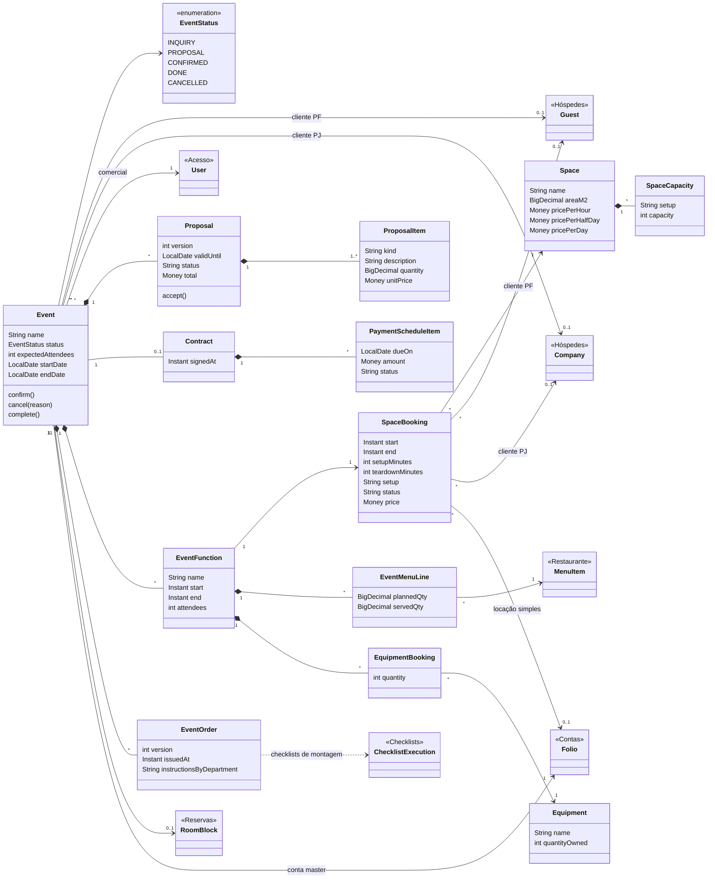
```mermaid
classDiagram
  direction LR

  class Space {
    String name
    BigDecimal areaM2
    Money pricePerHour
    Money pricePerHalfDay
    Money pricePerDay
  }
  class SpaceCapacity {
    String setup
    int capacity
  }
  class SpaceBooking {
    Instant start
    Instant end
    int setupMinutes
    int teardownMinutes
    String setup
    String status
    Money price
  }
  class Event {
    String name
    EventStatus status
    int expectedAttendees
    LocalDate startDate
    LocalDate endDate
    confirm()
    cancel(reason)
    complete()
  }
  class EventStatus {
    <<enumeration>>
    INQUIRY
    PROPOSAL
    CONFIRMED
    DONE
    CANCELLED
  }
  class Proposal {
    int version
    LocalDate validUntil
    String status
    Money total
    accept()
  }
  class ProposalItem {
    String kind
    String description
    BigDecimal quantity
    Money unitPrice
  }
  class Contract {
    Instant signedAt
  }
  class PaymentScheduleItem {
    LocalDate dueOn
    Money amount
    String status
  }
  class EventFunction {
    String name
    Instant start
    Instant end
    int attendees
  }
  class EventOrder {
    int version
    Instant issuedAt
    String instructionsByDepartment
  }
  class EventMenuLine {
    BigDecimal plannedQty
    BigDecimal servedQty
  }
  class Equipment {
    String name
    int quantityOwned
  }
  class EquipmentBooking {
    int quantity
  }
  class Guest {
    <<Hóspedes>>
  }
  class Company {
    <<Hóspedes>>
  }
  class MenuItem {
    <<Restaurante>>
  }
  class RoomBlock {
    <<Reservas>>
  }
  class Folio {
    <<Contas>>
  }
  class User {
    <<Acesso>>
  }
  class ChecklistExecution {
    <<Checklists>>
  }

  Space "1" *-- "*" SpaceCapacity
  SpaceBooking "*" --> "1" Space
  SpaceBooking "*" --> "0..1" Guest : cliente PF
  SpaceBooking "*" --> "0..1" Company : cliente PJ
  SpaceBooking "*" --> "0..1" Folio : locação simples
  Event --> EventStatus
  Event "*" --> "0..1" Guest : cliente PF
  Event "*" --> "0..1" Company : cliente PJ
  Event "*" --> "1" User : comercial
  Event "1" *-- "*" Proposal
  Proposal "1" *-- "1..*" ProposalItem
  Event "1" -- "0..1" Contract
  Contract "1" *-- "*" PaymentScheduleItem
  Event "1" *-- "*" EventFunction
  EventFunction "1" --> "1" SpaceBooking
  EventFunction "1" *-- "*" EventMenuLine
  EventMenuLine "*" --> "1" MenuItem
  EventFunction "1" *-- "*" EquipmentBooking
  EquipmentBooking "*" --> "1" Equipment
  Event "1" *-- "*" EventOrder
  EventOrder ..> ChecklistExecution : checklists de montagem
  Event "1" --> "0..1" RoomBlock
  Event "1" --> "1" Folio : conta master
```

#### 8.2.17 Distribuição e FNRH

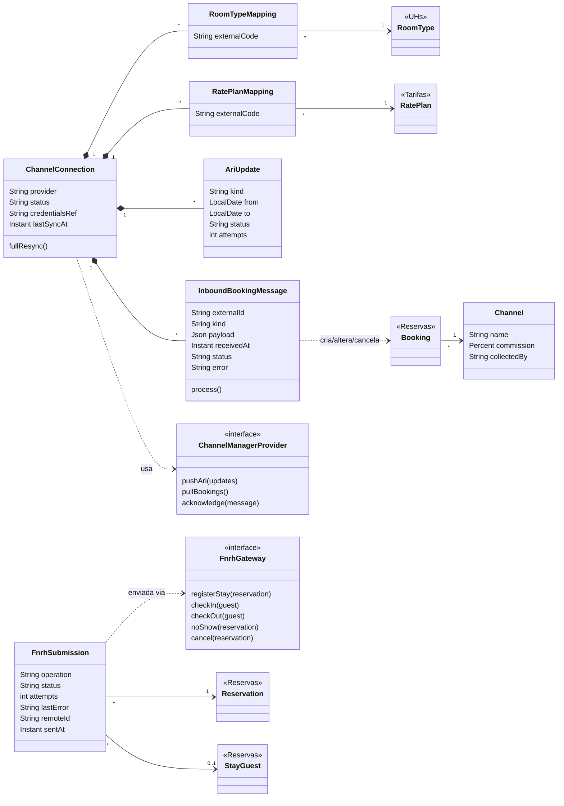
```mermaid
classDiagram
  direction LR

  class ChannelConnection {
    String provider
    String status
    String credentialsRef
    Instant lastSyncAt
    fullResync()
  }
  class Channel {
    String name
    Percent commission
    String collectedBy
  }
  class RoomTypeMapping {
    String externalCode
  }
  class RatePlanMapping {
    String externalCode
  }
  class AriUpdate {
    String kind
    LocalDate from
    LocalDate to
    String status
    int attempts
  }
  class InboundBookingMessage {
    String externalId
    String kind
    Json payload
    Instant receivedAt
    String status
    String error
    process()
  }
  class ChannelManagerProvider {
    <<interface>>
    pushAri(updates)
    pullBookings()
    acknowledge(message)
  }
  class FnrhSubmission {
    String operation
    String status
    int attempts
    String lastError
    String remoteId
    Instant sentAt
  }
  class FnrhGateway {
    <<interface>>
    registerStay(reservation)
    checkIn(guest)
    checkOut(guest)
    noShow(reservation)
    cancel(reservation)
  }
  class RoomType {
    <<UHs>>
  }
  class RatePlan {
    <<Tarifas>>
  }
  class Booking {
    <<Reservas>>
  }
  class Reservation {
    <<Reservas>>
  }
  class StayGuest {
    <<Reservas>>
  }

  ChannelConnection "1" *-- "*" RoomTypeMapping
  ChannelConnection "1" *-- "*" RatePlanMapping
  RoomTypeMapping "*" --> "1" RoomType
  RatePlanMapping "*" --> "1" RatePlan
  ChannelConnection "1" *-- "*" AriUpdate
  ChannelConnection "1" *-- "*" InboundBookingMessage
  ChannelConnection ..> ChannelManagerProvider : usa
  InboundBookingMessage ..> Booking : cria/altera/cancela
  Booking "*" --> "1" Channel
  FnrhSubmission "*" --> "1" Reservation
  FnrhSubmission "*" --> "0..1" StayGuest
  FnrhSubmission ..> FnrhGateway : enviada via
```

#### 8.2.18 Notificações e impressão

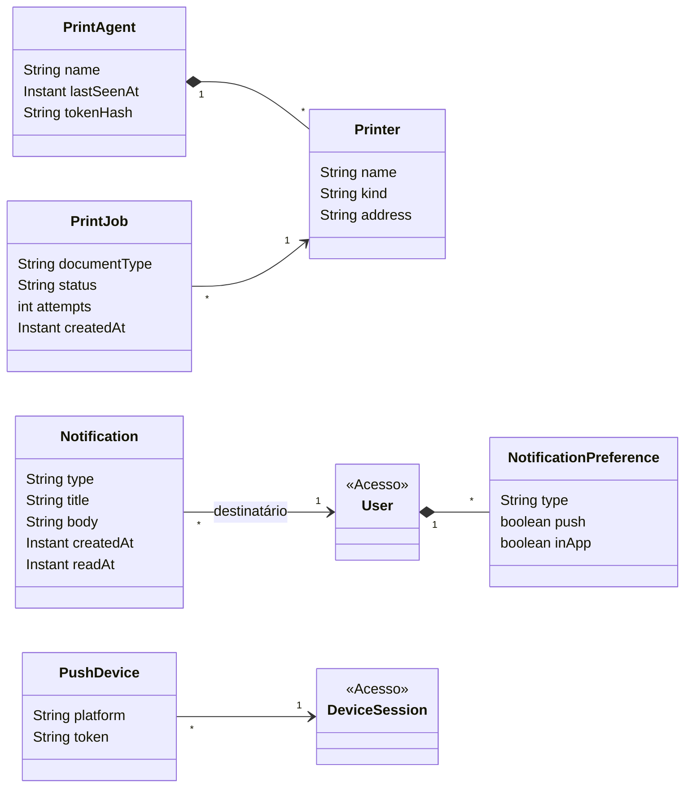
```mermaid
classDiagram
  direction LR

  class Notification {
    String type
    String title
    String body
    Instant createdAt
    Instant readAt
  }
  class NotificationPreference {
    String type
    boolean push
    boolean inApp
  }
  class PushDevice {
    String platform
    String token
  }
  class PrintAgent {
    String name
    Instant lastSeenAt
    String tokenHash
  }
  class Printer {
    String name
    String kind
    String address
  }
  class PrintJob {
    String documentType
    String status
    int attempts
    Instant createdAt
  }
  class User {
    <<Acesso>>
  }
  class DeviceSession {
    <<Acesso>>
  }

  Notification "*" --> "1" User : destinatário
  User "1" *-- "*" NotificationPreference
  PushDevice "*" --> "1" DeviceSession
  PrintAgent "1" *-- "*" Printer
  PrintJob "*" --> "1" Printer
```

### 8.3 Comunicação entre contextos (eventos principais)

| Evento | Publicado por | Consumido por | Efeito |
|---|---|---|---|
| `ReservationCreated` / `Changed` / `Cancelled` | Reservas | Distribuição, FNRH, Governança | ARI atualizado; registro/cancelamento na FNRH; plano de chegadas |
| `GuestCheckedIn` / `GuestCheckedOut` | Reservas | FNRH, Governança, Notificações | Envio à FNRH; tarefa de limpeza de saída; aviso à governança |
| `RoomMoved` | Reservas | Governança | Tarefa na UH de origem |
| `RoomStatusChanged` | UHs | Tempo real (SSE), Governança | Painel atualizado; UH pronta notificada à recepção |
| `OutOfOrderChanged` | UHs | Reservas (disponibilidade) | Contadores de inventário recalculados; alerta se houver reserva alocada |
| `AvailabilityChanged` | Reservas | Distribuição | ARI de disponibilidade enviado |
| `RatesChanged` / `RestrictionsChanged` | Tarifas | Distribuição | ARI enviado |
| `ChecklistCompleted` | Checklists | Estoque, Rouparia, Manutenção, Governança | Baixa de insumos; movimento de enxoval; OS; achado/dano |
| `HousekeepingTaskCompleted` | Governança | UHs, Notificações | Status da UH; aviso de UH pronta ou de inspeção pendente |
| `TabClosed` | Restaurante | Estoque, Fiscal | Baixa por ficha técnica; NFC-e |
| `PaymentSucceeded` | Pagamentos | Contas | Registra pagamento na conta/comanda/parcela |
| `FiscalDocumentAuthorized` / `Rejected` | Fiscal | Contas, Notificações | Vínculo da nota; alerta de rejeição |
| `BusinessDateAdvanced` | Hotel (via Fechamento) | Governança, Manutenção, Checklists | Tarefas do dia, preventivas e rotinas geradas |
| `StockBelowMinimum` | Estoque | Notificações | Alerta ao almoxarife |

### 8.4 Máquinas de estado

**Reserva**

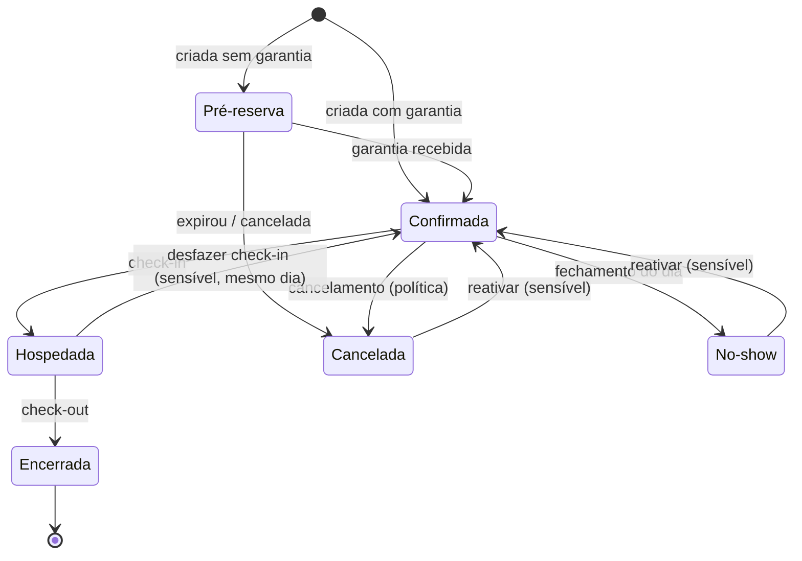
```mermaid
stateDiagram-v2
  state "Pré-reserva" as Provisional
  state "Confirmada" as Confirmed
  state "Hospedada" as InHouse
  state "Encerrada" as CheckedOut
  state "Cancelada" as Cancelled
  state "No-show" as NoShow

  [*] --> Provisional : criada sem garantia
  [*] --> Confirmed : criada com garantia
  Provisional --> Confirmed : garantia recebida
  Provisional --> Cancelled : expirou / cancelada
  Confirmed --> InHouse : check-in
  Confirmed --> Cancelled : cancelamento (política)
  Confirmed --> NoShow : fechamento do dia
  InHouse --> Confirmed : desfazer check-in (sensível, mesmo dia)
  InHouse --> CheckedOut : check-out
  Cancelled --> Confirmed : reativar (sensível)
  NoShow --> Confirmed : reativar (sensível)
  CheckedOut --> [*]
```

**Status de governança da UH.** O status de ocupação (Vago/Ocupado) e o OOO/OOS são dimensões separadas.

```mermaid
stateDiagram-v2
  state "Sujo" as Dirty
  state "Limpo" as Clean
  state "Limpo — inspeção pendente" as CleanPending
  state "Inspecionado" as Inspected

  [*] --> Dirty
  Dirty --> Clean : limpeza concluída (tipo sem inspeção)
  Dirty --> CleanPending : limpeza concluída (tipo com inspeção)
  CleanPending --> Inspected : inspeção aprovada
  CleanPending --> Dirty : inspeção reprovada
  Clean --> Inspected : inspeção voluntária
  Clean --> Dirty : check-out / fechamento / uso
  Inspected --> Dirty : check-out / fechamento / uso
```

**Tarefa de governança**

```mermaid
stateDiagram-v2
  state "Pendente" as Pending
  state "Atribuída" as Assigned
  state "Em andamento" as InProgress
  state "Pausada" as Paused
  state "Aguardando inspeção" as AwaitingInspection
  state "Reprovada" as Rejected
  state "Concluída" as Done
  state "Recusada (DND / hóspede)" as Refused
  state "Cancelada" as Cancelled

  [*] --> Pending
  Pending --> Assigned : distribuição publicada
  Assigned --> Assigned : reatribuída
  Assigned --> InProgress : iniciar
  InProgress --> Paused : pausar
  Paused --> InProgress : retomar
  InProgress --> Done : checklist concluído (sem inspeção)
  InProgress --> AwaitingInspection : checklist concluído (com inspeção)
  AwaitingInspection --> Done : aprovada
  AwaitingInspection --> Rejected : reprovada
  Rejected --> InProgress : refazer
  Assigned --> Refused : não perturbe / recusado
  Refused --> Assigned : nova tentativa
  Pending --> Cancelled
  Assigned --> Cancelled
  Done --> [*]
```

**Documento fiscal**

```mermaid
stateDiagram-v2
  state "Pendente" as Pending
  state "Processando" as Processing
  state "Autorizado" as Authorized
  state "Rejeitado" as Rejected
  state "Cancelado" as Cancelled

  [*] --> Pending
  Pending --> Processing : enviado ao middleware
  Processing --> Authorized : autorizado
  Processing --> Rejected : rejeitado
  Rejected --> Pending : corrigido e reenviado
  Authorized --> Cancelled : cancelamento (sensível, no prazo)
  Authorized --> [*]
  Cancelled --> [*]
```

---

## 9. Fases de entrega

Não há data definida. As fases seguem a ordem de dependência. **Para a inauguração, o mínimo são as Fases 0, 1 e 2**, já que o hotel abre com OTAs, restaurante aberto ao público e emissão fiscal.

| Fase | Conteúdo | Resultado |
|---|---|---|
| **0 — Fundação** | Infraestrutura (repositório, CI, Docker compose, contrato OpenAPI); núcleo compartilhado; ACS (usuários, roles, escopo, aprovação, auditoria); CFG; PES (escala); UHs, áreas e status; motor de checklists (sem ações de estoque e enxoval); notificações internas; tempo real; base da sincronização offline | Base sobre a qual todos os módulos são construídos |
| **1 — Hospedagem** | Hóspedes; tarifas (planos, restrições, pacotes, políticas); reservas, grupos e bloqueios; recepção; FNRH; contas e caixa com pagamento manual; fechamento do dia; governança completa; manutenção corretiva e OOO/OOS; painel e relatórios operacionais; agente de impressão | O hotel opera a hospedagem. Notas emitidas manualmente no portal da prefeitura até a Fase 2. |
| **2 — Receita e fiscal** | Channel manager; Pix integrado; cartão integrado e caução; fiscal (NFS-e, NFC-e, IBS/CBS); PDV do restaurante e bar (comandas, produção, café da manhã, lançamento no quarto, taxa de serviço) | **Pronto para inaugurar** |
| **3 — Suprimentos** | Estoque e compras; NF-e XML; fichas técnicas com baixa automática; ações de checklist (baixa de insumos, troca de enxoval); rouparia e lavanderia terceirizada; lavanderia do hóspede; itens de empréstimo | Custos e insumos sob controle |
| **4 — Comercial e gestão** | Eventos completos e locação de espaços; contas a receber; manutenção preventiva e ativos; KPIs e relatórios gerenciais; exportação contábil; automação de retenção LGPD | Gestão completa |
| **Futuro** | Interface do hóspede (pré-check-in pela FNRH, notificações, portal); financeiro administrativo (se confirmado); fechaduras; PABX; RMS; ponto eletrônico; multi-idioma | — |

---

## 10. Questões em aberto

| ID | Questão | Padrão adotado até decidir |
|---|---|---|
| Q-01 | Financeiro administrativo (contas a pagar, fluxo de caixa, DRE, conciliação): construir no sistema ou usar ERP/contador? | Fora da v1; exportar dados |
| Q-02 | Regime tributário do hotel (Simples Nacional, Lucro Presumido ou Real)? Afeta IBS/CBS a partir de 2027. | Configurável; middleware fiscal resolve |
| Q-03 | Município do hotel: usa o emissor nacional de NFS-e ou sistema próprio? Qual a alíquota de ISS? Existe taxa municipal de turismo? | Middleware abstrai; taxa de turismo configurável e desligada |
| Q-04 | Consumo de A&B lançado no quarto: NFC-e no consumo ou no check-out? Café incluso na diária entra na NFS-e (regime de hotelaria)? Validar com o contador. | NFC-e no check-out, agrupada; café incluso na NFS-e da hospedagem |
| Q-05 | Fornecedores: channel manager (HotelRunner, Omnibees, outro), PSP Pix, adquirente (TEF ou Smart POS), middleware fiscal | Interfaces neutras; decidir antes da Fase 2 |
| Q-06 | Onde roda o servidor: nuvem ou local? | Suportar ambos; decidir antes da Fase 2 |
| Q-07 | Retenção local dos dados sensíveis da FNRH (raça/cor, deficiência) e prazo de anonimização dos perfis | Expurgar 30 dias após o checkout; perfis anonimizados 5 anos após a última estadia |
| Q-08 | Taxa de serviço: em quais pontos de venda? Incide sobre a diária? Qual % de retenção para encargos (até 20% no Simples, 33% nos demais)? | Apenas A&B; retenção configurável |
| Q-09 | Política de overbooking | Proibido |
| Q-10 | Idiomas: só pt-BR na v1? Extratos e confirmações em inglês/espanhol para estrangeiros? | Só pt-BR; i18n preparado |
| Q-11 | Nomes de classes e código em inglês, com glossário PT | Inglês |
| Q-12 | Cadastur ativo e credencial da FNRH (pré-requisitos operacionais) | Responsabilidade do hotel antes da Fase 1 |
| Q-13 | Tecnologias dos clientes (desktop, mobile, PDV) — fora deste repositório, mas afetam a integração TEF (biblioteca local) e o offline (banco local no app) | Definir antes da Fase 1 |
| Q-14 | Turndown (abertura de cama) existe no serviço do hotel? | Tipo de limpeza disponível, desativado |
| Q-15 | Cortesia e uso da casa contam como UH vendida nos indicadores? | Cortesia conta na ocupação e não no ADR; uso da casa não conta em nenhum dos dois |

---

## 11. Referências

**Legislação e órgãos oficiais**

- Portaria MTur nº 41/2025 (FNRH Digital): <https://www.gov.br/turismo/pt-br/centrais-de-conteudo-/publicacoes/atos-normativos-2/2025/portaria-mtur-no-41-de-14-de-novembro-de-2025>
- Documentação da API FNRH v2.4 (Serpro/MTur): <https://www.gov.br/turismo/pt-br/acesso-a-informacao/acoes-e-programas/programas-projetos-acoes-obras-e-atividades/ficha-nacional-de-registro-de-hospedes/modulo-meio-de-hospedagem/meios-de-hospedagem-com-pms/documentacao-api-v2-4-2.pdf>
- LC 214/2025 (IBS/CBS), regimes específicos de hotelaria e de bares e restaurantes (arts. 273–283)
- Portaria MTur 28/2025 (regras de diária, check-in/out e limpeza)
- ECA (Lei 8.069/1990), arts. 82 e 250
- Lei 13.419/2017 (gorjeta / taxa de serviço)
- LC 116/2003, item 9.01 (ISS sobre hospedagem)
- LGPD (Lei 13.709/2018)

**Referências de produto**

- Oracle OPERA Cloud User Guide: End of Day, Room Management, Routing, Cashiering, Role Manager
- Mews Help Center: user roles, city ledger, POS, automação do fechamento
- Cloudbeds Help Center: Night Audit, Allotment Blocks
- apaleo: tipos de manutenção (OOO/OOS/OOI)
- HotelRunner Custom Apps API: integração de PMS com channel manager
